---
title: Lecture 11
subtitle: Forward Kinematics
author: |
    | Alli Nilles 
    | Modern Robotics Chapter 4
date: October 3, 2019
aspectratio: 169
...


Admin
=====

> - Homework 4 should be demonstrated individually to your TA in lab by next
week.
> - Homework 5 is due this Friday.
> - Lab 2 is due this week.

Last Time
=========


{width=500px class="center"}\


$$
T(\theta) = e^{[\mathcal{S_1}]\theta_1} \ldots
e^{[\mathcal{S_{n-1}}]\theta_{n-1}} e^{[\mathcal{S_{n}}]\theta_{n}} M
$$


Approach
========

> - Choose a fixed, global base frame $\{s\}$
> - Choose an "end effector" frame $\{b\}$ fixed to the robot
> - Choose a "zero position" for all joints
> - Let $M \in SE(3)$ be the configuration of $\{b\}$ in the $\{s\}$ frame when
robot is in zero position

. . .

$M$ defines the initial pose of the end effector in the global frame.

. . .

Transforming $M$ transforms the pose of the end effector!


Applying Joint Motions
======================


1. Define screw axis $S_i$ for each joint in the zero position in global frame
    - for revolute joints, this is the axis of rotation $\omega$ and the
        "tangential velocity" $v = - \omega \times q$

. . .

2. Compute $e^{[S_i] \theta}$ for each screw motion

. . .

3. Multiply terms in correct order (furthest joint affects $M$ first)

. . .

$$
T(\theta) = e^{[\mathcal{S_1}]\theta_1} \ldots
e^{[\mathcal{S_{n-1}}]\theta_{n-1}} e^{[\mathcal{S_{n}}]\theta_{n}} M
$$


Actual Form of Matrix Exponential
=================================


{width=600px class="center"}\

. . .

{width=700px class="center"}\

{width=400px class="center"}\

How to Compute?
===============

{width=700px class="center"}\

How to compute $e^{[\omega]\theta}$?

. . .

Same way we compute any matrix exponential!

$$
e^{[\omega]\theta} = I + [\omega]\theta + [\omega]^2 \frac{\theta^2}{2!} + [\omega]^3 \frac{\theta^3}{3!}
+ \ldots
$$

But what is $[\omega]^3$?

Computing Exponential Coordinate of Rotation
============================================

\begin{align*}
e^{[\omega]\theta} & = I + [\omega]\theta + [\omega]^2 \frac{\theta^2}{2!} + [\omega]^3 \frac{\theta^3}{3!}
+ \ldots \\
e^{[\omega]\theta} & = I + (\theta - \frac{\theta^3}{3!} + \frac{\theta^5}{5!} -
\ldots) [\omega] + 
(\frac{\theta^2}{2!} - \frac{\theta^4}{4!} + \frac{\theta^6}{6!} - 
\ldots) [\omega]^2
\end{align*}

. . .

And we know that

\begin{align*}
\sin{\theta} & = \theta - \frac{\theta^3}{3!} + \frac{\theta^5}{5!} - \ldots \\
\cos{\theta} & = 1 - \frac{\theta^2}{2!} + \frac{\theta^4}{4!} - \ldots
\end{align*}

Computing Exponential Coordinate of Rotation
============================================

So we have

$$
e^{[\omega]\theta} = I + \sin{\theta} [\omega] + (1-\cos{\theta}) [\omega]^2
$$

. . .

What kind of movement does this represent?

. . .

What is the difference between this and $e^{[S_i]\theta}$?


One More Example
================

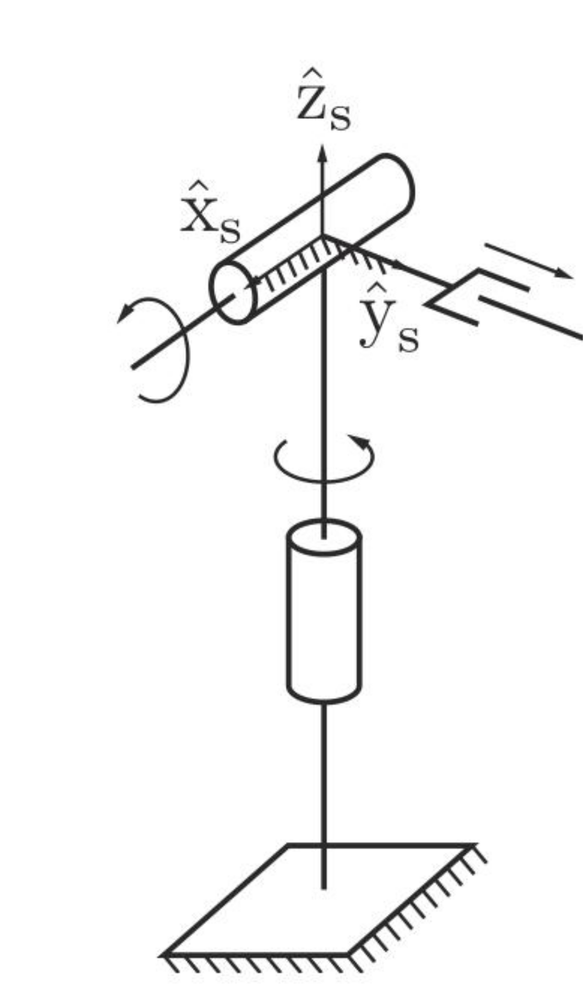{width=250px class="center"}\


Example
=======

What is $M$?

. . .

$$
M = \begin{bmatrix}
1 & 0 & 0 & 0 \\
0 & 1 & 0 & L_3 \\
0 & 0 & 1 & L_1 + L_2 \\
0 & 0 & 0 & 1 \\
\end{bmatrix}
$$

. . .

What are $\omega_i$ and $v_i$ for each joint?

. . .

$\omega_1 = (0, 0, 1)$ and $v_1 = (0,0,0)$

. . .

$\omega_2 = (1, 0, 0)$ and $v_2 = (0,L_1 + L_2,0)$

. . .

$\omega_3 = (0, 0, 0)$ and $v_3 = (0,1,0)$


PoE in the End-Effector Frame
=============================

We have the identity

$$
e^{M^{-1} P M} = M^{-1} e^{P} M
$$

. . .

which can be rewritten as

$$
e^P M = M e^{M^{-1} P M}
$$


PoE in the End-Effector Frame
=============================

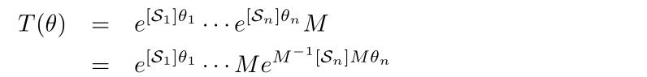{width=600px class="center"}\

. . .

{width=600px class="center"}\

. . .

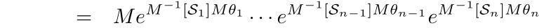{width=600px class="center"}\

What is $M^{-1} [S_i] M$?

. . .

{width=600px class="center"}\


Now, fun stuff!
===============

<div class="row">
<div class="column" width="70%">

<div align="center" style="float;padding:24px">
<iframe width="500" height="400"
src="images/mochibot.mp4">
</iframe></div>

</div>
<div class="column" width="30%">

Keio University and University of Tokyo, IROS 2018

</div>
</div>

Closed Kinematic Chains
=======================

What if my robot isn't just a chain, but has branches or loops?

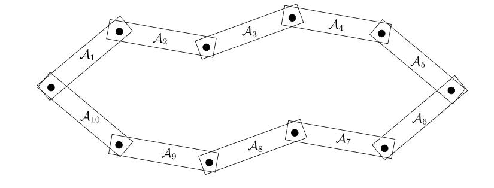{width=600px class="center"}\

Where is the "base"??


Closed Kinematic Chains
=======================

Break and turn into a tree:

{width=500px class="center"}\

Closed Kinematic Chains
=======================

Write down transformations for each branch:

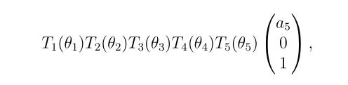{width=500px class="center"}\

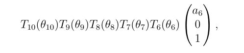{width=500px class="center"}\


Closed Kinematic Chains
=======================

But we need to enforce closure:

{width=600px class="center"}\

Very difficult to characterize even in simple cases, often impossible!

Four-Bar Linkages
=================


<div class="row">
<div class="column" width="50%">

<div align="center" style="float;padding:24px">
<iframe width="300" height="300"
src="images/pumpjack.mp4">
</iframe></div>

</div>
<div class="column" width="50%">

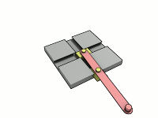{width=300px class="center"}\

</div>
</div>

Other types of joints
=====================

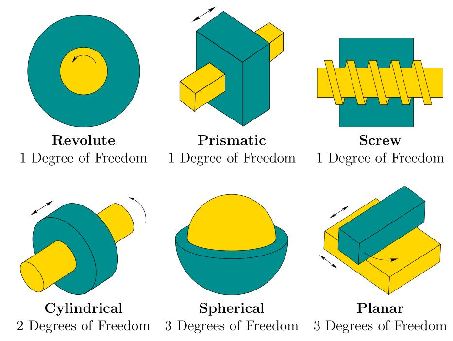{width=600px class="center"}\

Discussion on Representations
===============================


Our fancy screw motion matrix exponential is just another way to write down
homogenous transformations in three dimensions!

. . .

Our usual homogenous transformation matrices can also be used for forward
kinematics (this is usually called the Denavit-Hartenberg (DH) representation).

. . .

With DH parameterization, we define a frame for each link in the frame of the
previous link. So to compute the position of the end effector, a frame for each
link must be defined in terms of the previous link.

. . .

With screw motions, we have only two reference frames (the base and the end
effector), and then each joint screw motion is defined in the base frame.


URDF
====

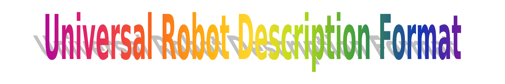{width=700px class="center"}\

{width=300px class="center"}\

What Does it Look Like?
====


<div class="row">
<div class="column" width="50%">

{width=350px class="center"}\


</div>
<div class="column" width="50%">

```
<robot name="pr2">
  <link> ... </link>
  <link> ... </link>
  <link> ... </link>

  <joint>  ....  </joint>
  <joint>  ....  </joint>
  <joint>  ....  </joint>
</robot>
```

</div>
</div>


Links
=====

{width=450px class="center"}\

Links
=====

- inertial

```
<inertial>
 <origin xyz="0 0 0.5" rpy="0 0 0"/>
 <mass value="1"/>
 <inertia ixx="100"  ixy="0"  ixz="0" iyy="100" iyz="0" izz="100" />
</inertial>
```

. . .

- visual

```
<origin xyz="0 0 0" rpy="0 0 0" />
<geometry>
    <box size="1 1 1" />
</geometry>
<material name="Cyan">
    <color rgba="0 1.0 1.0 1.0"/>
</material>
```

Links
=====

- collision


```
<origin xyz="0 0 0" rpy="0 0 0"/>
<geometry>
    <cylinder radius="1" length="0.5"/>
</geometry>
</collision>
```


{width=450px class="center"}\


Joints
======

Required elements:

> - origin
> - parent
> - child

. . .

Optional elements:

> - axis
> - calibration
> - dynamics
> - limits
> - safety controller

What Cannot Be Modelled?
========================

- closed kinematic chains
- flexible structures

{width=450px class="center"}\


Challenges
==========

XML is not very readable or writeable by humans

<div class="row">
<div class="column" width="50%">

XML:

```xml
<launch>
    <arg name="world" default="simple_world"/>
    <arg name="init_pos_x" default="0.0"/>
    <arg name="init_pos_y" default="0.0"/>
	<node pkg="gazebo_ros" type="spawn_model"
		name="spawn_robot"
		respawn="false" output="screen"
		args="-param robot_description
        -urdf
        -x $(arg init_pos_x)
        -y $(arg init_pos_y)
        -z $(arg init_pos_z)
        -model youbot">
    </node>
</launch>
```

</div>
<div class="column" width="50%">

YAML:

```yaml

- world: simple_world
- init_pos_x: &init_pos_x 0.0
- init_pos_y: &init_pos_x 0.0
- node:
	- pkg: gazebo_ros
	- type: spawn_model
	- name: spawn_robot
	- respawn: false
	- output: screen
	- args:
		- param robot_description
        - urdf
        - x *arg init_pos_x
        - y *init_pos_y
        - z *arg init_pos_z
        - model youbot

```

</div>
</div>


Workarounds
===========


<div class="row">
<div class="column" width="50%">

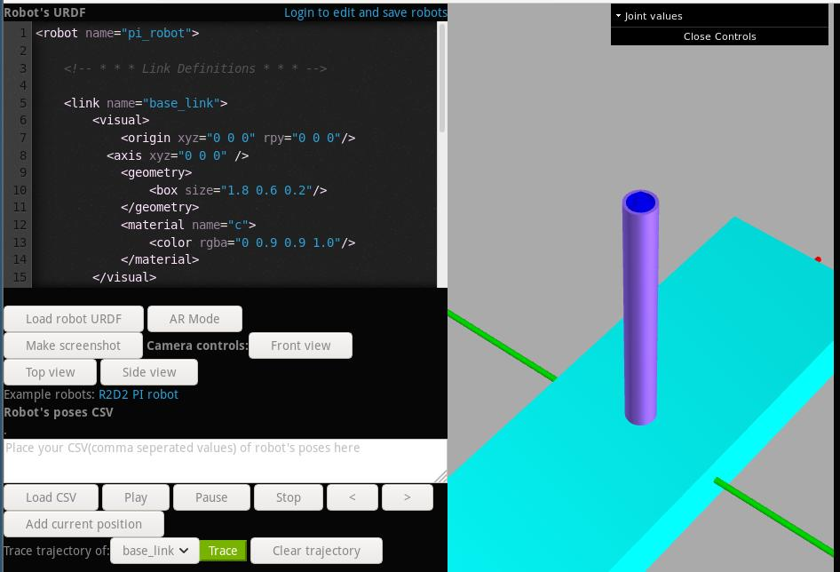{width=300px class="center"}\

<a href = "http://www.mymodelrobot.appspot.com/5629499534213120">Online URDF
editor</a>

</div>
<div class="column" width="50%">

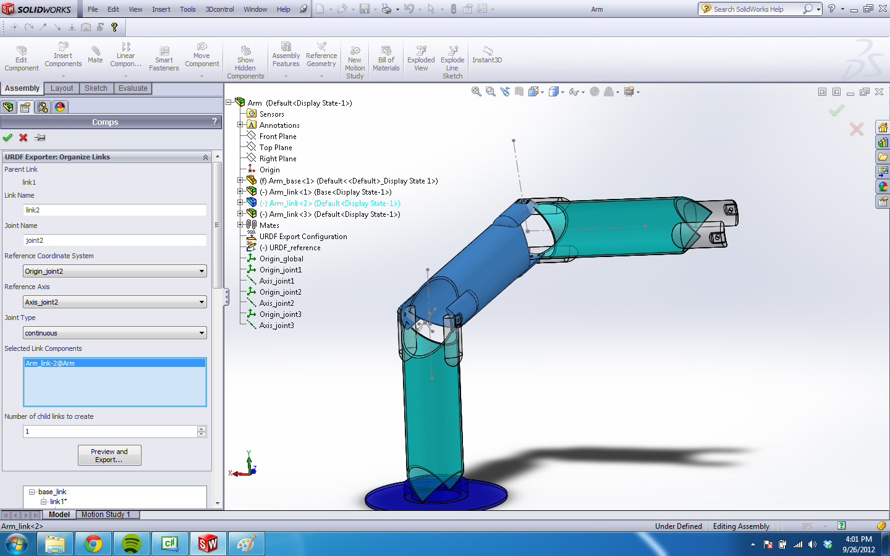{width=300px class="center"}\

SolidWorks plugin

</div>
</div>


Active Developments in Robot Programming
========================================

> - Live coding / interactive interfaces
> - Readability (python >>> c++)
> - Formal guarantees
>   - strict types
>   - dimensional analysis
>   - probabilistic programming
>   - logical specifications & synthesis


Trade-offs
==========


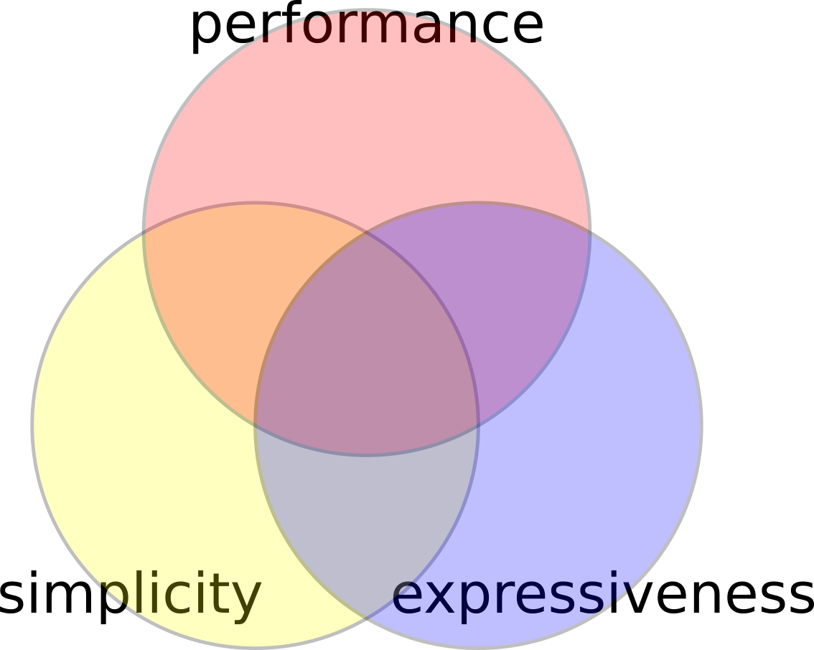{width=500px class="center"}\
