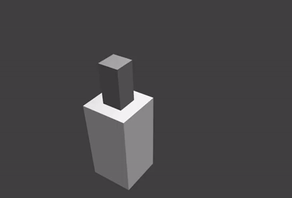

---
title: Lecture 10
subtitle: Forward Kinematics
author: |
    | Alli Nilles 
    | Modern Robotics Chapter 4
date: October 1, 2019
aspectratio: 169
...

Admin
=============================

> - I am not KDC!
> - Homework 4 should be demonstrated individually to your TA in lab this week
or next. Next week is the last week of Lab 3.
> - Homework 5 is due this Friday.
> - Lab 2 is due this week.

What is "Forward Kinematics"?
=============================

**Kinematics**: a branch of *classical mechanics* that describes motion of
bodies without considering forces. AKA "the geometry of motion"

. . .

**Forward kinematics**: a specific problem in robotics. Given the individual state of each
joint of the robot (in a local frame), what is the position of a
given point on the robot in the global frame?

. . .

{width=600px class="center"}\

Assumptions
=====================

> - Our robot is a kinematic chain, made of rigid *links* connected by movable
*joints*
> - No branches or loops (will discuss later)
> - All joints have one degree of freedom and are *revolute* or *prismatic*

. . .

{width=520px class="center"}\

Review on Screw Motions
=======================

{width=600px class="center"}\

Review on Screw Motions
=======================

Definition 3.24 from Modern Robotics:  a **screw axis** $\mathcal{S}$ is written as

$$
\mathcal{S} = \begin{bmatrix} \omega \\ v \end{bmatrix} \in \mathbb{R}^6
$$ where either

> - $\lvert \lvert \omega \rvert \rvert = 1$
>    - where $v = -\omega \times q + h\omega$, where $q$ is a point on
       the axis of the screw and $h$ is the pitch of the screw ($h=0$ for a pure
       rotation about the screw axis). OR
       
> - $\lvert \lvert \omega \rvert \rvert = 0$ and $\lvert \lvert v \rvert \rvert = 1$
>    -  where the pitch of the screw is infinite and the motion is a
translation along the axis defined by $v$.

Screw Motions as Matrix Exponential
===================================

The screw axis $\mathcal{S}$ can be expressed in matrix form as

$$
[\mathcal{S}_i] = \begin{bmatrix}
[\omega_i] & v \\
0 & 0
\end{bmatrix} \in se(3)
$$

where $[ \ldots ]$ is the skew symmetric form.

. . .

To express a **screw motion** given a screw axis, we use the matrix exponential

$$
e^{\left[\mathcal{S}\right] \theta} \in SE(3)
$$

But why?!?
==========

> - Outside the scope of this course...
> - "The exponential map is a map from the Lie algebra of a Lie group to the group
itself"

. . .

You can think of the Lie algebra as related to a tangent space, so a screw
vector gives us a description of instantaneous tangent motion, and the
exponential function "integrates" this motion over a displacement $\theta$.

. . .

Actual Form of Matrix Exponential
=================================

{width=600px class="center"}\

. . .

{width=700px class="center"}\

{width=400px class="center"}\

Modelling Robot Joints as Screw Motions
======

$\mathcal{S} = \begin{bmatrix} \omega \\ v \end{bmatrix} \in \mathbb{R}^6$

case 1:

> - $\lvert \lvert \omega \rvert \rvert = 1$
>    - where $v = -\omega \times q + h\omega$, where $q$ is a point on
       the axis of the screw and $h$ is the pitch of the screw **($h=0$ for a pure
       rotation about the screw axis)**.
>    - So for revolute joints, $\omega$ is axis of rotation and $v = -\omega
       \times q$

{width=200px class="center"}\

       
Modelling Robot Joints as Screw Motions
======

$\mathcal{S} = \begin{bmatrix} \omega \\ v \end{bmatrix} \in \mathbb{R}^6$

case 2:

> - $\lvert \lvert \omega \rvert \rvert = 0$ and $\lvert \lvert v \rvert \rvert = 1$
>    -  where the pitch of the screw is infinite and the motion is a
        translation along the axis defined by $v$.
>    - **prismatic joints** defined by axis of movement $v$

{width=300px class="center"}\

Product of Exponentials Approach
===============================

{width=700px class="center"}\

**Key Idea:** Model each joint as applying a screw motion to all links beyond
it.

Product of Exponentials Approach
===============================

Let each joint $i$ have an associated parameter $\theta_i$ that defines its
configuration (rotation angle for revolute joints, translation amount for
prismatic).

. . .

Initialization:

> - Choose a fixed, global base frame $\{s\}$
> - Choose an "end effector" frame $\{b\}$ fixed to the robot
> - Put all joints in "zero position"
> - Let $M \in SE(3)$ be the configuration of $\{b\}$ in the $\{s\}$ frame when
robot is in zero position

Product of Exponentials Formula
===============================

For each joint $i$, define the screw axis.

. . .

For each motion of a joint, define the screw motion.

. . .

This form composes nicely through multiplication, giving us the **Product of
Exponentials (PoE)** formula!

$$
T(\theta) = e^{[\mathcal{S_1}]\theta_1} \ldots
e^{[\mathcal{S_{n-1}}]\theta_{n-1}} e^{[\mathcal{S_{n}}]\theta_{n}} M
$$

Visualizing the Formula
=======================

{width=700px class="center"}\

Example 1
=========

{width=700px class="center"}\

Example 1
=========

$$
M = \begin{bmatrix}
1 & 0 & 0 & L_1 + L_2 + L_3 \\
0 & 1 & 0 & 0 \\
0 & 0 & 1 & 0 \\
0 & 0 & 0 & 1 \\
\end{bmatrix}
$$

. . .

All axes:

$\omega_i = (0,0,1)$

. . .

For each joint:

. . .

$v_1 = (0,0,0)$

. . .

$v_2 = (0,-L,0)$

. . .

$v_3 = (0,-(L_1 + L_2),0)$

Example 1
=========

Form $e^{[\mathcal{S_i}] \theta}$ for each joint:

$$
e^{[\mathcal{S_i}] \theta} = \begin{bmatrix} 
e^{[\omega_i] \theta} & (I \theta + (1 - \cos(\theta) [\omega_i] + (\theta -
\sin(\theta) [\omega_i]^2) v_i \\
0 & 1
\end{bmatrix}
$$

And compose with $M$

$$
T(\theta) = e^{[\mathcal{S_1}]\theta_1}
e^{[\mathcal{S_{2}}]\theta_{2}} e^{[\mathcal{S_{3}}]\theta_{3}} M
$$

Example 2
=========

{width=600px class="center"}\

Example 2
=========

First find $M$:

$$
M = \begin{bmatrix}
0 & 0 & 1 & L_1 \\
0 & 1 & 0 & 0 \\
-1 & 0 & 1 & -L_2 \\
0 & 0 & 0 & 1 \\
\end{bmatrix}
$$

. . .

For joint 1: $\omega_1 = (0,0,1) \qquad v_1 = (0,0,0)$

. . .

For joint 2: $\omega_2 = (0, -1, 0) \qquad q_2 = (L_1, 0, 0) \qquad v_2 = (0, 0, -L_1)$

. . .

For joint 3: $\omega_3 = (1, 0, 0) \qquad q_3 = (0, 0, -L_2) \qquad v_3 = (0, -L_2, 0)$

Next Time
=========

> - Product of exponentials in the end-effector frame
> - Modelling robots in the **Universal Robot Description Format**
> - Different kinds of joints
> - What if my robot isn't a kinematic chain??

{width=400px class="center"}\

A Side Note on Representations
===============================

So this fancy screw motion matrix exponential is just another way to write down
homogenous transformations in three dimensions!

. . .

Our usual homogenous transformation matrices can also be used for forward
kinematics (this is usually called the Denavit-Hartenberg (DH) representation).

. . .

But screw motions are a more *natural* model for the kinds of robots we are
discussing.

. . .

With DH parameterization, we define a frame for each link in the frame of the
previous link. So to compute the position of the end effector, a frame for each
link must be defined.

. . .

With screw motions, we have only two reference frames (the base and the end
effector), and then each joint screw motion is defined in the base frame.

