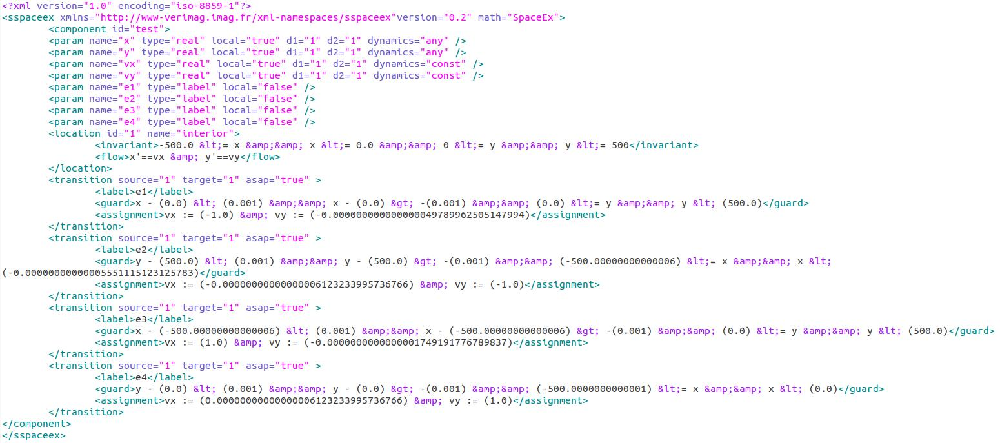
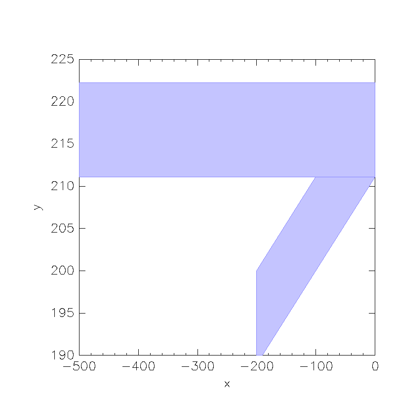
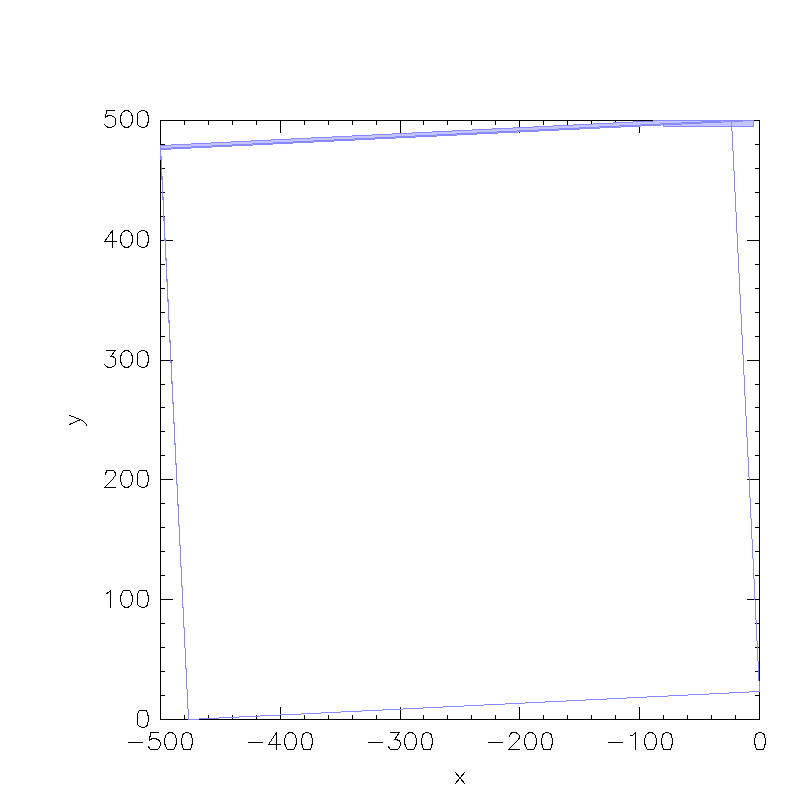

Overall Goals
--------------

> - model a system, related to billiards, which has applications in robotics
> - become more familiar with reachability analysis and how to state queries in
   terms of invariants
> - result: created an interface from an existing simulator for this system to SpaceEx


Blind, Bouncing Robots [^1]
----------------------

Model the robot as a point moving **in straight lines** in the plane, "bouncing" off the boundary
at a **fixed angle** $\theta$ from the normal:


Questions from Robotics
------------------

> -   What kind of tasks are robots with extremely simple control laws capable of
      performing?
> -   *Localization:* Will the robot become "trapped" in a small part of the environment? Or a
      low-dimensional motion pattern?
> -   *Coverage:* How completely and evenly does the robot cover the environment?


. . .


[^1]: [@bounce]


Implementation
--------------

> - Assume we know environment exactly
> - Can implement on a roomba with bump sensor and IR prox detector [^2]
> - "Collisions" can be virtual - for example, robot w/ camera stops when it is collinear
    with two landmarks, and rotates until one landmark is at a certain heading
> - Also useful model of very small "robots" or microorganisms [^5], or robots in
    low-bandwith environments

[^2]: [@LewOKa13], IJRR
[^5]: [@microorganism2017]


Applications
------------

\centering
\


Discovery Through Simulation
----------------------------

-   Haskell with *Diagrams* library [@yorgey2012monoids]
-   fixed-angle bouncing, specular bouncing, add noise
-   render diagrams from simulations automatically [^7]

[^7]: \url{https://github.com/alexandroid000/bounce}

\centering

{width=3cm}\


Simulation Results
------------------

\begin{figure}[tp]
\begin{subfigure}{.37\textwidth}
\centering
\includegraphics[width=\linewidth]{../figures/pent_05rad.pdf}
\end{subfigure}%
\begin{subfigure}{0.37\textwidth}
\includegraphics[width=\linewidth]{../figures/pent_1rad.pdf}
\end{subfigure}
\begin{subfigure}{0.37\textwidth}
\includegraphics[width=\linewidth]{../figures/pent_165rad.pdf}
\end{subfigure}%
\begin{subfigure}{0.37\textwidth}
\includegraphics[width=\linewidth]{../figures/pent_3rad.pdf}
\end{subfigure}
\end{figure}


Other Polygons
--------------

\begin{figure}
\begin{subfigure}{.5\textwidth}
\centering
\includegraphics[width=0.8\linewidth]{../figures/shear.pdf}
\caption{A stable orbit in a sheared pentagon.}
\label{shear}
\end{subfigure}%
\begin{subfigure}{0.5\textwidth}
\centering
\includegraphics[width=0.6\linewidth]{../figures/oct.pdf}
\caption{A stable orbit in a nonconvex environment.}
\label{oct}
\end{subfigure}
\caption{Stable orbits also exist in non-regular polygons. }
\label{squish-shear}
\end{figure}


What We Want
------------

> - check if cycle exists where theory says it does for convex polygons
> - do experiments with nonconvex polygons to develop theory there
> - minimize simulation / discretization / floating point artifacts
> - extend to multiple robots and nondeterministic bouncing

. . .

Tools from this class especially help with the last two


Reachability Modelling Approach
-----------------------------

\centering

\begin{tikzpicture}[->,>=stealth',auto,node distance=2.5cm,
  thick,main node/.style={circle,draw,minimum size = 1.7cm, font=\scriptsize}]
\node[main node] (x0)   [align=center] {$\dot{x} = v_x$\\$\dot{y} =v_y$};

\path[]
    (x0) edge [loop above,thick] node {$e_1$} (x0)
    (x0) edge [loop right,thick] node {$e_2$} (x0)
    (x0) edge [loop left,thick] node {$e_3$} (x0)
    (x0) edge [loop below,thick] node {$e_4$} (x0);

\end{tikzpicture}


Modelling Transitions
-----------------

\centering
\


Modelling Transitions
--------------------


If robot is colliding with wall, $(x,y) = (x_1, y_1) + s((x_2, y_2) - (x_1,
y_1))$, and $0 \leq s < 1$

. . .

**Pre:** $\frac{x-x_1}{x_2-x_1} == \frac{y-y_1}{y_2-y_1} \wedge 0 \leq s < 1$

*Note 1: This decides "corner collisions" consistently.*


*Note 2: Requires special case for vertical/horizontal edges*

. . .

**Eff:**

$v_x := \cos(\theta_{edge} + \theta_c)$


$v_y := \sin(\theta_{edge} + \theta_c)$

. . .

Compute concretely in Haskell, put floating point numbers into SpaceEx...
Motivation for using dReach?

. . .

Only supports single-valued $\theta_c$ (for now)


Results
-------

```haskell
loc1 = Location 1 "interior" 
        "-500.0 &lt;= x &amp;&amp; 
         x &lt;= 0.0 &amp;&amp; 
         0 &lt;= y &amp;&amp; 
         y &lt;= 500" 
        "x'==vx &amp; y'==vy"

square_ha :: HA
square_ha = HA   { name = "test"
               , params = mkParams $ mkPoly sq
               , locations = [loc1]
               , transitions = mkTs (mkPoly sq) (0 @@ rad)
               }
```


Results
-------

{width=13cm}\


Results of Simulations 
----------------------


When bouncing between parallel sides, SpaceEx finds fixed point within a few
iterations!

This type of bouncing is geometrically exact: $f_{1,3}(f_{3,1}(x)) = x$ if
$f_{i,j}$ is the
mapping from side $e_i$ to side $e_j$.


\centering

{width=5.5cm}\ {width=5cm}\ 


Results of Simulations - Nonconvergence w/ Asymptotic Stability
------------------

When periodic orbit is asymptotically stable, SpaceEx does not appear to
converge (700+ iterations, several minutes, how long to wait?)

\centering
{width=5.5cm}\ {width=5cm}\


Limitations / Future Work
-----------

> - `asap` transitions not working for some reason: must specify invariant in
  location to keep robot from "escaping" the polygon
> - Also not sure how to specify nonconvex invariants
> - Both supposed to be included in PHAVer on SpaceEx [@minopoli2014non]

. . .

> - Naive code generation: chunking strings together (only a few fields in xml file we
    need to change)
> - Next step is to use Haskell XML Toolbox (HXT) to make this less janky


More Future Work
-----------


> - Build in support for bounce angle intervals
> - Limit cycle detection with reachability (if robot starts in interval on
    edge $i$, show it will not reach the complement of that interval)
> - Use this as subroutine for synthesis algorithms: given environment, what bounce angles produce
    paths with certain properties (coverage, limit cycles)?
> - Modelling / synthesizing strategies over multiple angles (generate multiple
>   automata and compose)
> - Multiple robots and collisions (including robots sticking together?)


References
---------

\tiny
