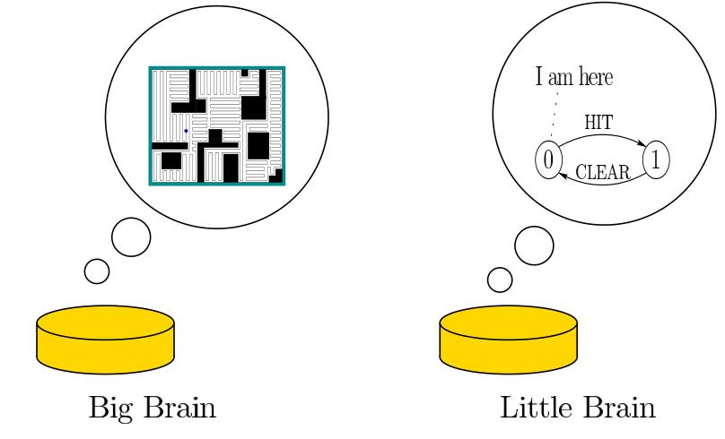

Simple Mobile Robots
--------------------

-   Mobile robots can vacuum floors, transport goods in warehouses, act as
    security robots (patrol), etc
-   We want to **minimize** sensing and computation (less expensive, more energy
    efficient)
-   Often, they can bump into things and be ok!
-   How can we use **contact with the environment** as a strategy or source of information?

\centering

{width=6cm}\

Blind, Bouncing Robots [^1]
----------------------

Abstract the robot as a point moving in the plane, "bouncing" off the boundary
at a fixed angle $\theta$ from the normal:

Research Questions
------------------

Given a constant control strategy, will the robot become "trapped" in part of
the environment? Or in a certain motion pattern? We focus on **patrolling**:
periodically orbiting the workspace.

[^1]: [@bounce], ICRA

Ok, but why?
---------------

-   Using geometry of a space, can create movement strategies with guaranteed
    properties (here, following a periodic path)
    -   warehouses, offices, need patrolling robots to monitor conditions
    -   what is the minimal sensing/computation/actuation required?
-   Assume robot has two primitives
    -   move straight
    -   align heading wrt wall normal

### But is it physically realizable?

- can implement on a roomba with bump sensor and IR prox detector [^2]
- "collisions" can be virtual - for example, robot stops when it is collinear
  with two landmarks, and rotates until one landmark is at a certain heading

[^2]: [@LewOKa13], IJRR

Related Work
------------

-   minimal sensing, actuation, computation requirements for mapping, navigating, localizing, patrolling, pursuit evasion
    *(@tovar2005gap, @bilo2012reconstructing, @OkaLav06, @disser11)*
-   specular billiards *(@billiards)*, pinball billiards *(@pinball)*
-   **aspecular billiards**, microorganism billiards *(@microorganism2017)*

{width=10cm}\

Limit Cycles In Regular Polygons
================================

Question
--------

If we can only move in straight lines and align relative to wall normal:

> Can we guarantee that a robot **patrols** a space on a periodic path?

Can also phrase as:

> What are the conditions on limit cycles in this dynamical system?

Discovery Through Simulation
----------------------------

-   Haskell with *Diagrams* library [@monoids]
-   fixed-angle bouncing, relative bouncing (rotate $\theta$ from previous heading), specular bouncing, add noise
-   render diagrams from simulations automatically [^7]

[^7]: \url{https://github.com/alexandroid000/bounce}

\centering

{width=3cm}\

In Regular Polygons
-------------------

Ignore movement in interior, only track position on boundary when robot
collides. Defines a **discrete dynamical system**

$$x_{n+1} = f(x_n)$$

Given regular polygon, with edge length $\ell$ and internal angle $\phi$, we can
define the mapping function

$$ b_{\theta} : (0, \ell) \to (0, \ell) $$

Sequential-Edge Bouncing
------------------------

In regular polygons with side length $\ell$ and internal angle $\phi$:

\begin{align*}
&b_{\theta} : (0, \ell) \to (0, \ell) \\
&b_{\theta}(x) = c(\theta) (\ell-x) \tag*{$c(\theta) = \frac{\cos(\theta)}{\cos(\theta -
\phi)}$}
\end{align*}

\centering

{width=10cm}\

Fixed Point of Mapping Function $\iff$ Periodic Orbit
-----------------------------------------------------

\columnsbegin

\column{0.5\textwidth}

\

\column{0.5\textwidth}

\

\columnsend

What is the Fixed Point?
---------------------------

\begin{block}{Mapping Function}
\begin{align*}
b_{\theta}(x) = c(\theta) (\ell-x) \tag*{$ c(\theta) =
\frac{\cos(\theta)}{\cos(\theta-\phi)}$}
\end{align*}
\end{block}

\columnsbegin

\column{0.5\textwidth}

\

\column{0.5\textwidth}

\begin{align*}
b_{\theta}(x_{FP}) = x_{FP} \\
c(\theta) (\ell-x_{FP}) = x_{FP} \\
x_{FP} = \frac{\ell c(\theta)}{1+c(\theta)}
\end{align*}

\columnsend

For clockwise bouncing, reflect across the midpoint of the edge:  $\to \ell - x_{FP}$

Is the Fixed Point Unique?
------------------------------

\begin{block}{Mapping Function}
\begin{align*}
b_{\theta}(x) = c(\theta) (\ell-x) \tag*{$ c(\theta) =
\frac{\cos(\theta)}{\cos(\theta-\phi)}$}
\end{align*}
\end{block}

When we check how distances change under the map, we see that
\begin{align*}
d(b_{\theta}(x), b_{\theta}(y)) & = | c(\theta)(\ell-y) - c(\theta)(\ell-x)| \\
                               & = | c(\theta) (x-y) | \\
                               & = | c(\theta) | d(x,y).
\end{align*}

Thus if $|c(\theta)| < 1$, then $b_{\theta}$ is a contraction mapping, and by the Banach fixed-point
theorem, it has a unique fixed point [@Granas2003].

Bounds on $\theta$
------------------------------------------

To get bounds on $\theta$ for guaranteeing periodic
trajectories:

-   solve $|\frac{\cos(\theta)}{\cos(\theta-\phi)}| < 1$
-   take geometric feasibility into account (for non-regular polygons)

So now we have a statement for the existence and stability of the
fixed points, for counterclockwise bouncing striking each edge of a regular
polygon:

\begin{proposition} \label{Proposition:1}
\begin{equation*}
x_{FP} = 
\begin{cases}
        \frac{\ell c(\theta)}{1 + c(\theta)} & \phi/2 < \theta
< \pi/2 \\
        \frac{\ell}{1+c(\theta)} & -\pi/2 < \theta
< -\phi/2
\end{cases}
\end{equation*}

\noindent in which $c(\theta) = cos(\theta) / cos(\theta - \phi)$.
\end{proposition}

Confirmation and Generalization
----------------------

We have shown the case for counterclockwise bounces, on every sequential edge.

We can also imagine going clockwise, and/or skipping edges:

\begin{figure}[tp]
\begin{subfigure}{.37\textwidth}
\centering
\includegraphics[width=\linewidth]{figures/pent_05rad.pdf}
\end{subfigure}%
\begin{subfigure}{0.37\textwidth}
\includegraphics[width=\linewidth]{figures/pent_1rad.pdf}
\end{subfigure}
\end{figure}

Mapping function, convergence conditions go through very similarly (see paper)

Simulation Results
------------------

\begin{figure}[tp]
\begin{subfigure}{.37\textwidth}
\centering
\includegraphics[width=\linewidth]{figures/pent_05rad.pdf}
\end{subfigure}%
\begin{subfigure}{0.37\textwidth}
\includegraphics[width=\linewidth]{figures/pent_1rad.pdf}
\end{subfigure}
\begin{subfigure}{0.37\textwidth}
\includegraphics[width=\linewidth]{figures/pent_165rad.pdf}
\end{subfigure}%
\begin{subfigure}{0.37\textwidth}
\includegraphics[width=\linewidth]{figures/pent_3rad.pdf}
\end{subfigure}
\end{figure}

Nice Properties
---------------

-   any regular $n$-gon
-   stable orbits are **independent of starting position**
-   exponential convergence
-   bounds on $\theta$ from $|c(\theta)| < 1$: any angle in this range will make
    similar orbits

\centering

\includegraphics[width=4cm]{figures/multi_start.pdf}

Adding Noise
------------

Other Polygons
--------------

\begin{figure}
\begin{subfigure}{.5\textwidth}
\centering
\includegraphics[width=0.8\linewidth]{figures/shear.pdf}
\caption{A stable orbit in a sheared pentagon.}
\label{shear}
\end{subfigure}%
\begin{subfigure}{0.5\textwidth}
\centering
\includegraphics[width=0.6\linewidth]{figures/oct.pdf}
\caption{A stable orbit in a nonconvex environment.}
\label{oct}
\end{subfigure}
\caption{Stable orbits also exist in non-regular polygons. }
\label{squish-shear}
\end{figure}

Open Problems & Future Work
-------------

-   How to characterize and exploit non-periodic dynamics?
    -   Lyapunov exponents suggest chaotic dynamics
    -   relationship to dispersion: what is the longest unvisited edge interval
        as the system evolves?
-   Extensions to non-regular polygons and smooth environments
-   Error bounds: model different disturbances to bounce
-   Feedback control: counting number of bounces, make walls distinguishable /
    colored, allow robot to place and/or detect landmarks

\centering

\vspace{-2em}

{width=3.5cm}\

# Thank you! {.standout}

References
---------

\tiny
