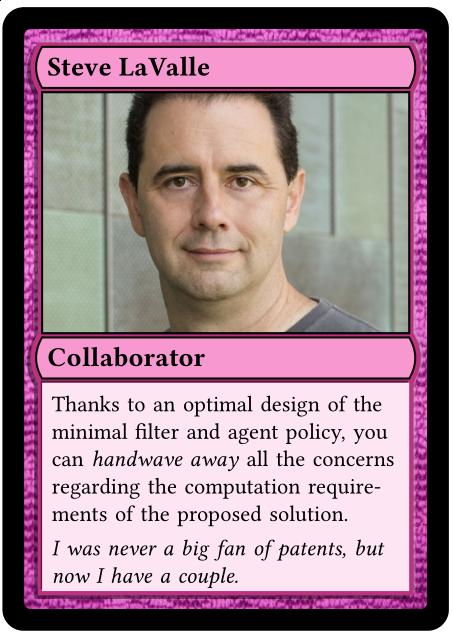
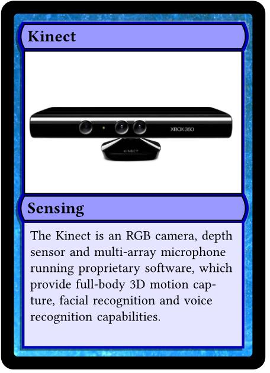
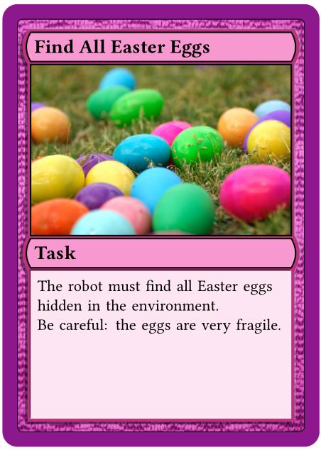

Outline
=======


> -   **Bouncing robots:** discovering (and proving) dynamical properties of simple robot motion models
>     -   find minimal control and hardware that gives desired properties: periodic motion or
>         other attractors, coverage
>     -   SpaceEx project, possible future directions         
> -   **Improv:** high-level language for control of mobile robots
>     -   small domain-specific language, compiles to ROS
>     -   Future work: type-level checks and/or explicit model checking (with
>         DryVR?)?
> -   **Aggregate robot systems:** dynamics of local interactions toward minimal control
> -   **Automatic robot design** and automation of Robot Design Game


General Approach to Robot Decisionmaking
================================

> - focus on information spaces: space of all histories of sensor readings and actions
    taken
> - can reduce to different space (ex: only keep track of one bit: robot on wall,
    or not on wall)
> - can encode dynamical information explicity (equations) or implicitly (if robot goes
    forward forever, it will hit something)
> - can create filters, planners over information spaces (good for when we don't
    know, or don't need to know, physical state space)
> - **task specific** design: how to specify tasks?


Mobile Robots
=============

> - many mobile robot tasks are actually properties of the path the robot takes
    through space
    - coverage, environmental monitoring, patrolling, navigation
> - many simple models of mobile robot motion
> - which ones have nice dynamical properties that we can get "for free"
    (without a lot of feedback control)?


Blind, Bouncing Robots
======================

Model the robot as a point moving **in straight lines** in the plane, "bouncing" off the boundary
at a **fixed angle** $\theta$ from the normal:


Trapping or Coverage Properties
===============================


Implementation
==============


> - Assume we know environment exactly
> - Can implement on a roomba with bump sensor and IR prox detector [^2]
> - "Collisions" can be virtual - for example, robot w/ camera stops when it is collinear
    with two landmarks, and rotates until one landmark is at a certain heading
> - Also useful model of very small "robots" or microorganisms [^5], or robots in
    low-bandwith environments

[^2]: [@LewOKa13], Lewis & O'Kane IJRR 2013
[^5]: [@microorganism2017], Thiffeault et. al. Physica D Nonlinear Phenomena
2017


Discovery Through Simulation
============================


-   Haskell with *Diagrams* library [@yorgey2012monoids]
-   fixed-angle bouncing, specular bouncing, add noise
-   render diagrams from simulations automatically [^7]

[^7]: \url{https://github.com/alexandroid000/bounce}

\centering

{width=3cm}\


Simulation Results
==================


\begin{figure}[tp]
\begin{subfigure}{.37\textwidth}
\centering
\includegraphics[width=\linewidth]{../figures/pent_05rad.pdf}
\end{subfigure}%
\begin{subfigure}{0.37\textwidth}
\includegraphics[width=\linewidth]{../figures/pent_1rad.pdf}
\end{subfigure}
\begin{subfigure}{0.37\textwidth}
\includegraphics[width=\linewidth]{../figures/pent_165rad.pdf}
\end{subfigure}%
\begin{subfigure}{0.37\textwidth}
\includegraphics[width=\linewidth]{../figures/pent_3rad.pdf}
\end{subfigure}
\end{figure}


Other Polygons
==============


\begin{figure}
\begin{subfigure}{.5\textwidth}
\centering
\includegraphics[width=0.7\linewidth]{../figures/shear.pdf}
\caption{A stable orbit in a sheared pentagon.}
\label{shear}
\end{subfigure}%
\begin{subfigure}{0.5\textwidth}
\centering
\includegraphics[width=\linewidth]{../figures/nonconvex1.png}
\caption{A stable orbit in a nonconvex environment.}
\label{oct}
\end{subfigure}
\caption{Stable orbits also exist in non-regular polygons. }
\label{squish-shear}
\end{figure}


Goals
=====


> - confirm on-paper results and inspire new proofs
> - minimize simulation / discretization / floating point artifacts
> - synthesize controllers (bounce angles + some transition condition, depending
on sensors)

584 Project - Reachability in 2D with SpaceEx
=============================================


\centering code generation for given polygon and bounce angle


\begin{tikzpicture}[->,>=stealth',auto,node distance=2.5cm,
  thick,main node/.style={circle,draw,minimum size = 1.7cm, font=\scriptsize}]
\node[main node] (x0)   [align=center] {$\dot{x} = v_x$\\$\dot{y} =v_y$};

\path[]
    (x0) edge [loop above,thick] node {$e_1$} (x0)
    (x0) edge [loop right,thick] node {$e_2$} (x0)
    (x0) edge [loop left,thick] node {$e_3$} (x0)
    (x0) edge [loop below,thick] node {$e_4$} (x0);

\end{tikzpicture}


Results of Simulations 
=======================


When bouncing between parallel sides, SpaceEx finds fixed point within a few
iterations!

This type of bouncing is geometrically exact: $f_{1,3}(f_{3,1}(x)) = x$ if
$f_{i,j}$ is the
mapping from side $e_i$ to side $e_j$.


\centering

{width=5.5cm}\ {width=5cm}\ 


Results of Simulations - Nonconvergence w/ Asymptotic Stability
===============================================================


When periodic orbit is asymptotically stable, SpaceEx does not appear to
converge, even when trajectories should (mathematically) always return to same interval

. . .


How to encode "contraction" property, or automatically detect?

. . .

\centering
{width=4.5cm}\ {width=4cm}\


The Synthesis Problem
=====================

> - Use this as subroutine for synthesis algorithms: given environment, what bounce angles produce
    paths with certain properties (coverage, limit cycles)?
>   - Stability detection with reachability (if robot starts in interval on
      edge $i$, show it will not reach the complement of that interval)
> - Modelling / synthesizing strategies over multiple angles (generate multiple
>   automata and compose)


Results
=======

> - For synthesis: is exponential blow-up going to be a problem?

\centering
{width=8cm}\


Future Work
===========

> - Clean up codebase
> - Add support for bounce angle nondeterminsm
> - Keep developing mathematical theory
> - Incorporate minimal feedback control (what if we have a pebble, colored
>   walls, laser beams, etc) and information space representation
> - balance between small modelling distance (1D) and generality for other motion
>   primitives (2D)


Questions / Comments?
==========


\centering
\

**Acknowledgements:** Samara Ren, Michael Zeng, Israel Becerra, Steve LaValle


Improv
======

Project from Dr. Amy LaViers' 598 in Spring 2017 (Movement Representation and
High-Level Robotic Control), collaborated with Chase Gladish

. . .

"Live coding" high-level language for mobile robots using ROS

. . .

(show video)


Architecture Overview
=====================


\


Workflow
========

My current workflow:

> -   launch ROS and simulator
> -   edit ROS node, change motion sequence / controller
> -   reset simulator, relaunch ROS node
    -   can script using rosservice, launch files

. . .

What is live-coding?

> -   Usually has a performance/improvisational connotation
> -   requires low latency / flow


Problem $\iff$ Program
======================


```python
if __name__ == '__main__':
    pub = rospy.Publisher('turtle1/cmd_vel',Twist)
    rospy.init_node('publisher_node')
    loop_rate = rospy.Rate(5)
    while not rospy.is_shutdown():
        vel=Twist()
        vel.linear.x = 1.0
        vel.angular.z = 1.0
        pub.publish(vel)
        loop_rate.sleep()
```

Two Issues in Creating Robotic Motion
=====================================


### Live coding (with a motion DSL) addresses

1.  confusing workflow for beginners
    -   large number of steps required
    -   order of steps unclear
    -   hard to install programs
1.  bad mapping between problem domain and program domain
    -   have to "translate" our representation of task into software semantics

. . .

Formal methods and verification can help with step 2, as well as help provide
informative feedback when something goes wrong.


Using roshask [^1]
=================================


- Haskell client library for ROS
- interpret DSL to a Haskell ADT representing a movement pattern
- convert to ROS message


```haskell
mkTwist :: VelCmd Double -> Twist
mkTwist (VelCmd t r) = def  & angular . V.z .~ r
                            & linear . V.x .~ t
                            
```
[^1]: [@cowley2011stream]


The Modelling Problem
=====================

How to model motion in a way that is amenable to a simple, high-level DSL?


A Detour into Monoids
=====================


A *monoid* is a set $S$ along with a binary operation $\diamond :: S \to S \to
S$ and a distinguished element $\epsilon :: S$, subject to:

$$ \epsilon \diamond x = x \diamond \epsilon = x $$

\vspace{-2em}

$$ x \diamond (y \diamond z) = (x \diamond y) \diamond z $$

for all $x,y,z \in S$.

### Why think about monoids? [@monoids]

-   Simple algebraic model of composition
-   Can show common structures, build up abstraction quickly

Monoids
=======


![Composing a list of *Diagrams* primitives [@monoids]](../figures/diagrams.jpg)


Data Structures - Space
=======================

```haskell
data Dance b = Prim Action Mult b
             | Rest Mult
             | Skip -- id for series, parallel
             | Dance b :+: Dance b -- in series
             | Dance b :||: Dance b -- in parallel
        deriving (Show, Eq, Read)
```
. . .

```haskell
-- map over parts (for changing platforms)
instance Functor Dance where
    fmap f (x :+: y) = (fmap f x) :+: (fmap f y)
    fmap f (x :||: y) = (fmap f x) :||: (fmap f y)
    fmap f (Rest m) = Rest m
    fmap f (Skip) = Skip
    fmap f (Prim act m part) = Prim act m (f part)
```

Robot-Specific Specification
============================


```haskell
robotRes = 100 :: Mult -- messages/second, ROS publishing rate
robotRate = 1 :: Mult -- seconds per "beat"
```

. . .


```haskell
data Action = A Direction Extent

moveBase :: Action -> VelCmd Double
moveBase (A Center _)        = VelCmd 0 0 -- no articulation
moveBase (A _ Zero)          = VelCmd 0 0 -- no movement
moveBase (A Lef Quarter)     = VelCmd 0 (pi/2) -- rad/sec
moveBase (A Forward Quarter) = VelCmd 0.1 0 -- meters/sec

```
. . .

> - For round differential drive robot, rest of `moveBase` functions can be derived from these primitives!
> - Inspired by choreography and by *Dance* [@Dance2003]

Domain-Specific Language
===========

```haskell
x = [forward forward]
y = forward || right
r1 $ repeat (x y)
```

> -   top level is a free monoid (list)
> -   sequential composition (in brackets) causes all movements to happen in one
    "beat"
> -   parallel composition is collapsed to vector averages
> -   can define symmetries over directions and body parts
> -   `repeat`, `reflect`, `reverse`, `retrograde`


Opportunities for Formal Methods
================================


> -   would be nice to have model checking like that provided by *Koord*
> -   will robots collide? above a certain speed? are you asking for
      unexecutable motion (ie: move arm when it's already in extremal position)?
> -   need Haskell for ROS interfacing - unless someone models ROS client in
      K with code generation...
> -   some verification can be done at type level in Haskell; Haskell also has some
      verification/proof libraries
> -   could model Improv DSL in K and have some model of what the simulator
      is doing (DryVR). How modular is Koord / K / DryVR implementation?


Self-Assembly and Aggregate Robotics
====================================


\centering
{width=6cm}\ {width=6cm}\


Goal of Repeatable, Non-Reversible Motion
=========================================

{width=11cm}\

Is it possible to synthesize local interaction rules which lead to this type of
motion?

Automatic Robot Design
======================

\centering
{width=3cm}\ {width=3cm}\ {width=3cm}\

\raggedright

2016 and 2017 RSS workshops on minimalism and automated design

. . .

Given task and environment, and collection of sensors, actuators, computers, communication,
power, and form resources.

. . .

Game not formalized - would be fun to formalize!

. . . 

\url{www.robot-design.org}


References
==========

\tiny

