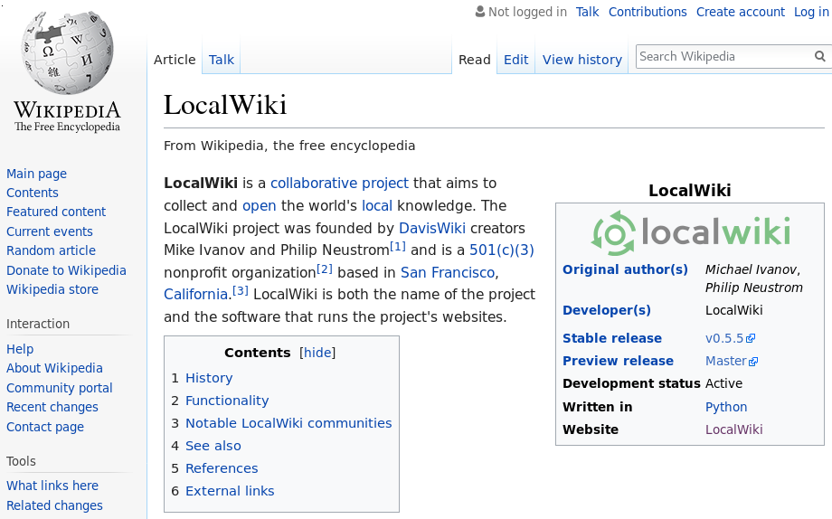

Goals
-----

> 1. Learn from each other
>     -   How do we use software in co-ops?
>     -   How does this software affect our day-to-day lives?
> 2. Introduce concepts:
>     -   Free and Open Source Software (FOSS)
>     -   Distributed/decentralized software
>     -   How does software affect cooperative autonomy?
>     -   Examples of existing tools
> 3. Future Visioning / Planning
>     -   How *could* we use software?
>     -   What needs to be done? How can we help to make co-ops more efficient
>         and effective?


Overview of Technologies
========================


What is Technology?
-------------------

\centering

\hspace*{-11mm}
\includegraphics[width=1.5\textwidth]{../figures/technology.jpg}


Cooperative Technology - What is it?
-------------------

\columnsbegin

\column{0.5\textwidth}


> -   signage
> -   dinner bell
> -   filing cabinet
> -   group messaging apps
> -   meeting rules / Robert's Rules of Order
> -   **systems and patterns of interaction, often (but not always) using physical tools**


\column{0.5\textwidth}

\


\columnsend


What to Automate?
-----------------

Don't want to replace all of these technologies with computers

. . .

But computers are good for some things! (Boring, repetitive things!)

. . .

> - Scheduling, voting (when not all parties can be in the same place)
> - Document storage, editing
> - Bookkeeping

Most Important Takeaway
-----------------------

\centering

\Large

**technology is just one component of culture**

. . .

\vspace{2em}

culture influences how people approach new technologies, how they use existing
technologies, and how they create new technologies

. . .

\vspace{2em}

"the revolution will not be televised..." or on your smartphone


Discussion
----------

\centering

\Large

What technologies does your co-op use for **decisionmaking**, **document
sharing**, and **bookkeeping**?

When do these work well, and when do they fail?

\large

Remember, technologies include things like rules for running meetings, written
notes, signs, as well as computerized technologies.


Free and Open Source Software
=============================


Why Care About Open Source?
---------------------------

\columnsbegin

\column{0.3\textwidth}

```python
def my_program(input):
    calculate the thing
    output "useful information"
    save "file_for_later.txt"
```

\column{0.3\textwidth}

\raggedright

\Huge

\hfill $\bm{\to}$

\column{0.3\textwidth}

```
0001010101010101
1010101010111110
0101010101011111
```

\columnsend

FOSS Principles
---------------

> "the freedom to use, study, copy, modify, and redistribute computer software"

Case Study: Quickbooks
----------------------

From Intuit's Terms of Service:

"Note that we may modify the **amount of storage space** you have through the
Services and the **number of times** (and the maximum duration for which) you may
access the Services in a given period of time... Your continued use of the Services
will constitute your acceptance of and agreement to such changes."

. . .

What if Intuit goes out of business? Or decides to double prices? Or their
servers are hacked and personal info is stolen/deleted?

Tradeoffs
---------

\centering

\Huge

convenience vs. control

. . .

\Large

\vspace{2em}
"just call the landlord" vs. self-management


Relevant Rochdale Principles
-------------------

> -   democratic member control
>     -   requires transparent and equal access to decisionmaking process
> -   member economic participation
>     -   requires transparent and equal access to economic process
> -   autonomy and independence
>     -   "Co-operatives are autonomous, self-help organizations controlled by
>         their members. If they enter into agreements with other organizations...
>         they do so on terms that ensure democratic control by their members and
>         maintain their co-operative autonomy."

. . .

Open source software is continually improved - bugs can be fixed by anyone, not
just developers working for company

Decentralized Software
======================


Decentralized Software
------------------------

\centering


Advantages
----------

Information is not "owned" by any one person/organization

. . .

If **everyone** has a copy of **all** the coop's documents, the documents are not
lost if one person leaves the co-op, if a computer dies, if a company goes out
of business...

. . .

Can use for documents, distributed ledgers (everyone keeps track of everyone's
transactions), etc


Examples of Co-op Software and Alternatives
========


Google Docs
-----------

Each document is "owned" by one Google account. This account can change
sharing settings, delete the document, etc.

Best Practices:

> -   Make a Google account for each "coordinator," then pass these accounts
>     between people as members change roles
> -   Save local backups / use Chrome "offline" extension

Alternative: distributed version control
----------------------------------------

**Git:** files are stored locally, and all changes are tracked on all computers
in the network. Used for collaborative document editing.

. . .

Created in 2005 for Linux.

. . .

Can use GitHub (semi-centralized solution) for better interfaces, hosting wikis,
etc.

Alternative: wikis
------------------

\


Loomio
------

-   centralized tool for decentralized organizations
-   open source, co-op run
-   integrated collection of tools for voting on proposals, scheduling meetings,
    polling groups


\Large

loomio.org

\


Platform Co-op
--------------


Resource for starting and finding co-ops with digital platforms (ride sharing,
journalism, finance, data management, etc)

\Large

platform.coop


Open ledgers
------------

> -   Everyone tracks all transactions that have ever happened
> -   Majority of people must agree to approve a transaction
> -   Basic idea behind bitcoin (though 96% of bitcoin is owned by 4% of the
>     network)
> -   Ideas could be useful for internal transactions in co-op (or network of
>     co-ops): needs more people working on it!

A Plea
------

\centering

\large

talk about software - criticize it - do not treat it as fixed

. . .

\vspace{2em}
recruit and support technologically-minded people

. . .

\vspace{2em}
consider creating space in your organizations for dedicated "software
coordinators"


Discussion
----------

\centering

\Large

What do we want computers to do for us?

What are the **obstacles** to changing technologies?

Which of these obstacles are **actionable**?
