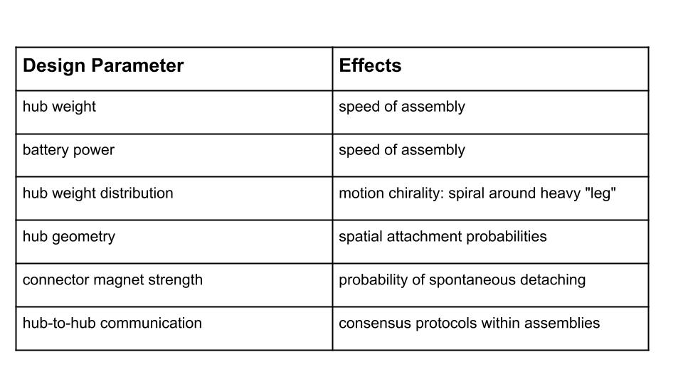
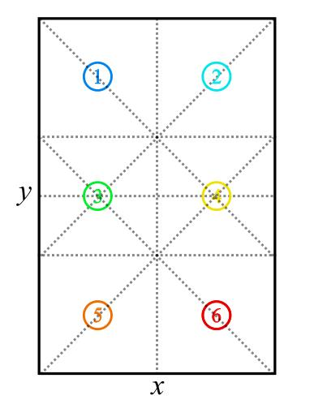

% Towards Self-Assembly and Collective Manipulation With Extremely Underactuated Robots
% Alli Nilles, Steve LaValle
% Justin Wasserman, Austin Born, Chris Horn, John Born

My Background
----------------

> - 2011-2015: BS in Engineering Physics at Colorado School of Mines
> - Summer 2014: REU with Dr. Jim Crutchfield at UC Davis
>   - complexity science, emergent dynamics, information processing of physical
>     systems
>   - start from "process" (list of sensor readings); infer causal states

. . .

{width=400px class="center"}

My Background
-------------

> - Fall 2015: started PhD with Steve LaValle
>    - "minimalism": underactuated / partially observable systems
>    - dynamics, control, and comparison of minimalist robotic systems
> - My focus:
>   - trajectories of mobile robots
>   - identifying "robust" properties of minimalist mobile robots
>   - interfaces and design tools (with RAD Lab, Dr. Amy LaViers)

. . .

{width=200px} {width=200px} {width=325px}

Guiding Principles
------------------

> - compliance and stabilizing dynamics (embedded / embodied computation) can reduce sensing and estimation requirements!
>   - work with physics, not against it ("carve nature at its joints")

> - identify task in information space, then track task-motivated information states, not physical states

> - make abstractions and interfaces that let humans recognize and design patterns

The Minimal-est Robot?
======================

Wild Bodies
---------------------

<iframe width="600" height="500" class="center"
src="images/large_weaselballs.mp4"
frameborder="0" allowfullscreen>
</iframe>

Information Spaces for Wild Bodies
----------------------------------

{width=700 class="center"}

. . .

Can layer probabilistic models on top of information state transition graph.

We can **control** density of bodies on a per-room basis, using environment
design.

And we can **track** number of bodies per room, using laser beam placement.

What are these "useless" robots good for?
-----------------------------------------------

> - similar systems could help collect data on extreme environments such as space, remote wilderness, ocean
> - micro-scale self-propelling particles [^1] [^2]
>   - similar movement profile
>   - lots of effort in manufacture and characterization, but control is more
>     difficult
>   - our platform could serve as a testbed for control approaches (easier to
>     manufacture and observe)

. . .

<iframe width="250" height="250" align="left"
src="images/janus.mp4"
frameborder="0" allowfullscreen>
</iframe>
<iframe width="250" height="250" align="right"
src="images/localize.mp4"
frameborder="0" allowfullscreen>
</iframe>

[^1]: ETH Zurich, Department of Materials YouTube channel
[^2]: Li, Jinxing, et al. "Self-propelled nanomotors autonomously seek and repair cracks." Nano letters 15.10 (2015): 7077-7085.

Goals of This Project
-----

> - **hardware** platform for experiments on control of active particle systems
> - **software** library for trajectory analysis and system design
> - **information spaces and filters** which are useful for scalable
    system control and monitoring

. . .

What tasks do we care about?

> - *coverage:* specify ensemble spatial density
> - *self-assembly:* specify desired distribution of shapes or sizes of assemblies
> - *manipulation:* move or cluster objects in environment

Weaselball Hub Design
---------------------

{width=700px class="center"}

 

Next step: **controllable detaching** (electro-permanent magnets or
shape-memory alloys) 

Assembly Example
----------------

<iframe width="700" height="500" class="center"
src="images/collective_formation.mp4"
frameborder="0" allowfullscreen>
</iframe>

Weaselball Hub Design Space
------------

 | **Hub**: the casing around the weaselball

 | **Agent** or **assembly**: one or more weaselball-hub pairs fixed together

. . .

{width=700px class="center"}

Gazebo Simulator
----------------

{width=500px} {width=250px}

Particle Simulator
------------------

<iframe width="700" height="500" class="center"
src="images/collisions.mp4"
frameborder="0" allowfullscreen>
</iframe>

Trajectory Analysis Library 
---------------------------

Input: videos of "circles" moving on any background

Output:

- x,y trajectories of centers of agents

Analysis Tools:

- visualize trajectories (static and animated)
- heat map of positions (given an environment discretization)

#### codebase started as collaboration with Dr. Yuliy Barishnikov ####

Trajectory Analysis Library 
---------------------------

In progress:

- environment shape detection
- registration with predefined assembly shapes
- orientation tracking of assembly shapes
- estimated agent velocity
- collision detection and characterization (scattering angles)
- free path lengths and trajectory shapes

. . .

Long-term goal:

- given video of arbitrary self-assembling agents (in 2D), cluster and
  characterize "types" of assemblies
- predict long-term spatial distribution of these agents in any given
  environment

Towards Control
===============

Control Ensemble, Not Individuals
---------------------------------

> - By controlling ensemble distributions of shapes and sizes, we can control ensemble dynamics.
> - Self-assembly (and disassembly) and collective manipulation do not have
to be independent tasks!
> - Smaller assemblies are faster, more mobile
> - Larger assemblies are less mobile, tend to be chiral, unless synchronized...

. . .

How to move from attach/detach rules to ensemble distributions? Starting to sound like thermodynamics...

Thermodynamical Interpretation
------------------------------

 microstates $\longleftrightarrow$ system configurations

 macrostates $\longleftrightarrow$ information states 

. . .

In thermodynamics, macrostates are quantities like temperature, pressure, etc.
What are some useful macrostates for our types of systems?

. . .

**Example 1: Counting Components** 

- sensor: 
   - $y = 1$ if a connection event happens
   - $y = -1$ if a disconnection event happens
- $\sum_i y_i = N$, the number of disconnected components at stage $i$

Thermodynamical Interpretation
------------------------------

**Example 2: Generalized Pressure**

If we model system as a gas...

$$ PV \propto nT $$

> - volume constant (fixed environment)
> - n known, or controllable
> - pressure is force exerted on environmental boundaries (measureable)
> - "temperature" is a function of the characteristic velocities of the agents
>    - many, fast agents $\to$ high pressure
>    - fewer, slow agents $\to$ low pressure

. . .

Varied spatial "pressure" leads to manipulation through mechanical interactions

Observed Patterns
--------

{width=500 class="center"}

{width=500 class="center"}

Clustering Experiments
-----------------------

<iframe width="600" height="250" class="center"
src="images/fast_push.mp4"
frameborder="0" allowfullscreen>
</iframe>

<iframe width="600" height="250" class="center"
src="images/t-push.mp4"
frameborder="0" allowfullscreen>
</iframe>

Toward Distributed Population Controllers
-----------------------------------------

Different equilibriums established from different rules for when to "detach".

$$ p(detach | I-state) = \quad ? $$

onboard I-state choices:

> - time since last attachment
> - size of current assembly (requires local comms)
> - frequency of collisions
>    - over what time window?
>    - can we distinguish other robots from the environment?

system I-state choices:

> - movement of objects (crossing beams)
> - "thermometer" or "pressure sensor" on walls or in certain regions

Analyzing Dynamics
------------------

For all choices, can tune probability of disconnection and look for phase
changes / sensitivity of equilibrium.

. . .

**Mean Field Approximation:**

Assuming even mixing of agents, and given reaction rates, equilibrium can be found
easily.

. . .

In the presence of structured environmental interactions, mean field
approximation becomes less realistic.

. . .

Traditional thermodynamic equilibrium models do not predict "active particle"
systems well.

. . .

For now, we are using stochastic simulations to investigate dynamical behavior 
and equilibriums, but would like to move toward not tracking or predicting individual
agent states at all.

Complex Example
---------------

<iframe width="600" height="500" class="center"
src="images/wheel.mp4"
frameborder="0" allowfullscreen>
</iframe>

Simulating the Micro with the Macro
---------------------------

In both cases, have access to region sensors (chemical comparators or laser
beams).

. . .

Is "disconnecting" an appropriate control input for micro-scale systems?

> - disconnects in aggregate active particle systems happen mechanically
> - controlled disconnect: DNA sticky ends + enzymes?!

. . .

How to simulate applied external fields?

> - replace weaselballs with controllable robot?
> - tilt tray?
> - "skatepark" to simulate smooth potentials?

Next Steps
----------

Try different information spaces and see which correspond well with different
modes of the system.

. . .

Change hub geometry to affect:

- the spatial probability of attaching (directed self-assembly) [^3]
- "scattering" interactions with walls (leave walls at more specific angle)

[^3]: Bhalla, N., Ipparthi, D., Klemp, E., & Dorigo, M. (2014, September). A geometrical approach to the incompatible substructure problem in parallel self-assembly. In International Conference on Parallel Problem Solving from Nature (pp. 751-760). Springer, Cham.

. . .

Co-design environment with controllers and sensors?

. . .

Agents can influence environment to guide robot-robot interactions?

Thank you! Questions?
----------

<iframe width="600" height="400" class="center"
src="images/collective_formation.mp4"
frameborder="0" allowfullscreen>
</iframe>

#### Presentation Template from https://github.com/PeterMosmans/presentation-template ####

