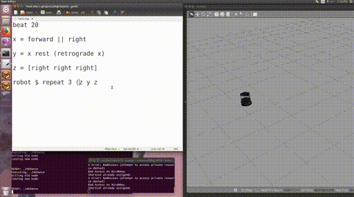
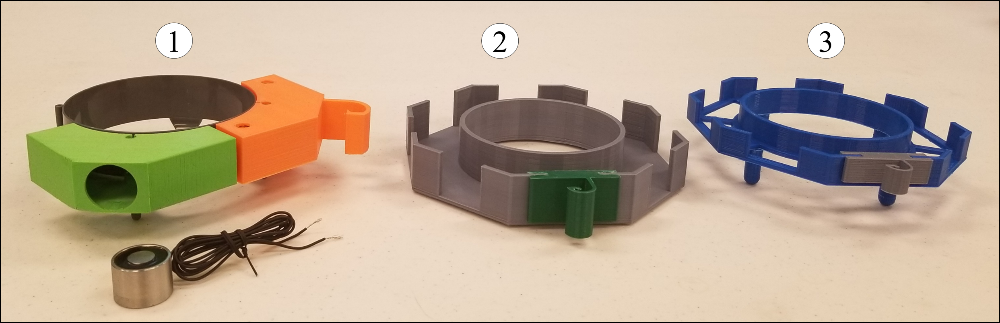
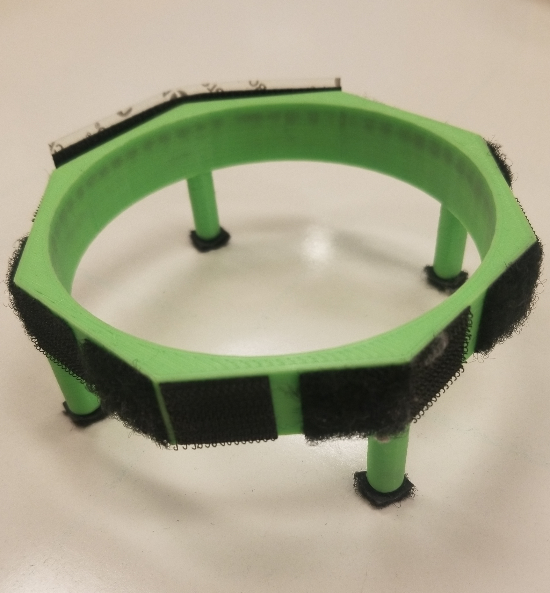
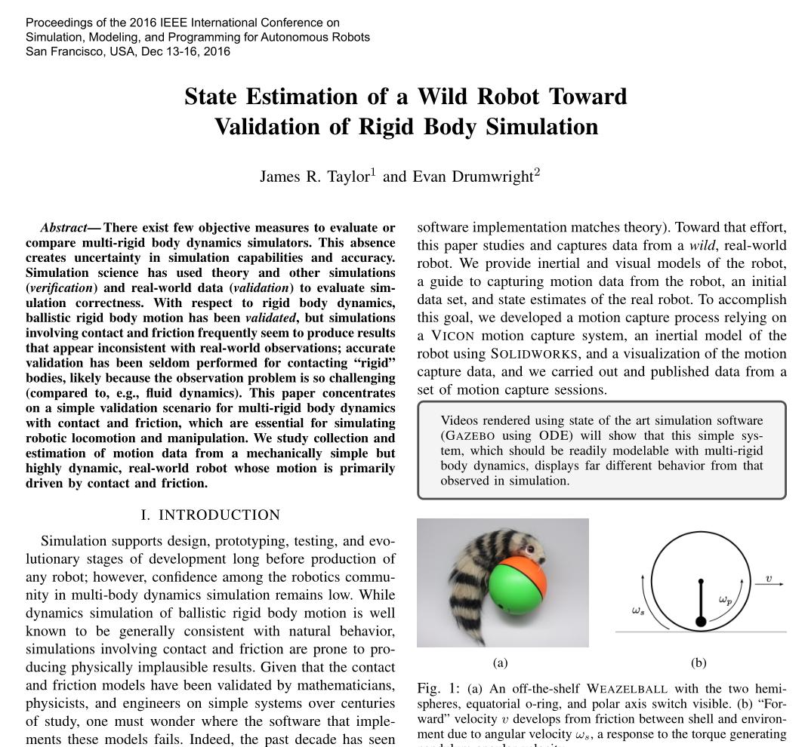
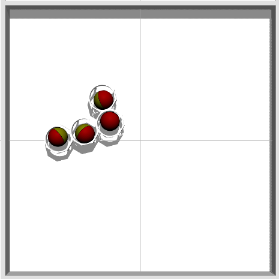
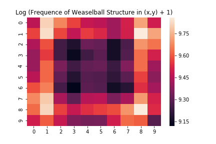
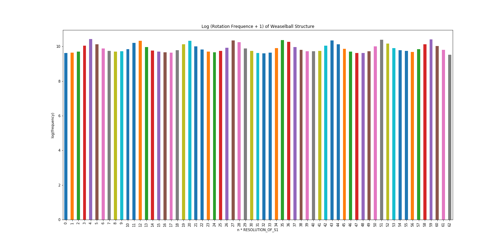

% Towards Self-Assembly and Collective Manipulation With Extremely Underactuated Robots
% Alli Nilles, Steve LaValle
% March 1, 2019

Outline
=======

1. Background on wild bodies and information spaces
2. Goals of this project
3. Tooling developed so far
4. Preliminary Results
5. Future Work

My Background
================

> - 2011-2015: BS in Engineering Physics
> - Summer 2014: REU with Dr. Jim Crutchfield at UC Davis
>   - complexity science, emergent dynamics, information processing of physical
>     systems
>   - start from "process" (list of sensor readings); infer causal states

. . .

{width=400px class="center"}

My Background
=============

> - Fall 2015: started PhD with Steve LaValle
>    - "minimalism": underactuated / partially observable systems
>    - dynamics and control of minimalist robotic systems (emphasis on synthesis)
>    - interfaces and design tools (with RAD Lab and Dr. Amy LaViers)

. . .

{width=200px} {width=200px} {width=300px}

Guiding Principles of My Research
==================

> - Compliance and dynamics (embedded / embodied computation) can reduce sensing and estimation requirements!
>   - Work with physics, not against it ("carve nature at its joints")

> - Identify task in information space, then track task-motivated information states, not physical states

> - Work toward human-centered abstractions

Wild Bodies
=====================

<iframe width="600" height="500" class="center"
src="images/large_weaselballs.mp4"
frameborder="0" allowfullscreen>
</iframe>

Information Spaces for Wild Bodies
==================================

{width=700 class="center"}

. . .

Can layer probabilistic models on top of information state transition graph.

We can **control** density of bodies on a per-room basis, using environment
design.

And we can **track** number of bodies per room, using laser beam placement.

What else could we do with the wild bodies?

Goals of This Project
=====

> - extend **hardware** platform
> - create **software** library for trajectory analysis and system design
> - create information spaces and filters which are useful for scalable
    control and monitoring of such systems
> - tasks
>     - predict and control ensemble spatial density
>     - controllable self-assembly (shapes or sizes of assemblies)
>     - collective manipulation of objects in environment

Joint work with Justin Wasserman, Austin Born, Chris Horn, John Born

WHY should we care about these uSeLeSs robots?!
===============================================

> - large groups of extremely underactuated robots could be useful for monitoring
  extreme environments such as space, remote wilderness, ocean
> - at micro-scale, self-propelling particles act extremely similarly (but are
  much harder to manufacture and observe)

. . .

<iframe width="300" height="300" class="center"
src="images/janus.mp4"
frameborder="0" allowfullscreen>
</iframe>

Weaselball Hub Design
=====================

{width=700px class="center"}

{height=250px} {height=250px}

Assembly Example
================

<iframe width="700" height="500" class="center"
src="images/collective_formation.mp4"
frameborder="0" allowfullscreen>
</iframe>

Gazebo Simulator
================

{width=500px} {width=250px}

Particle Simulator
==================

<iframe width="700" height="500" class="center"
src="images/collisions.mp4"
frameborder="0" allowfullscreen>
</iframe>

Trajectory Analysis Library 
===========================

Input: videos of "circles" moving on any background

Output:

- x,y trajectories of centers of agents

Analysis Tools:

- visualize trajectories (static and animated)
- heat map of positions (given an environment discretization)

#### codebase started as collaboration with Dr. Yuliy Barishnikov ####

Trajectory Analysis Library 
===========================

In progress:

- environment shape detection
- registration with predefined assembly shapes
- orientation tracking of assembly shapes
- estimated agent velocity
- collision detection and characterization (scattering angles)
- free path lengths and trajectory shapes

. . .

Long-term goal:

- given video of arbitrary self-assembling agents (in 2D), cluster and
  characterize "types" of assemblies
- predict long-term spatial distribution of these agents in any given
  environment

Observed Patterns
========

{width=400 class="center"}

{width=400 class="center"}

Ok, but what about high level control?
======================================

Insight: self-assembly (and disassembly) and collective manipulation do not have
to be independent tasks!

. . .

By controlling ensemble distributions of shapes and sizes, we can control ensemble dynamics.

. . .

Environment interactions guide how and when the robots interact with each other.

. . .

Hmm, this is starting to sound like thermodynamics...

Thermodynamical Interpretation
==============================

 microstates $\longleftrightarrow$ system configurations

 macrostates $\longleftrightarrow$ information states 

. . .

In thermodynamics, macrostates are quantities like temperature, pressure, etc.
What are some useful macrostates for multirobot systems?

. . .

**Example 1: Counting Components** 

- sensor: 
   - $y = 1$ if a connection event happens
   - $y = -1$ if a disconnection event happens
- $\sum_i y_i = N$, the number of disconnected components at stage $i$

Thermodynamical Interpretation
==============================

**Example 2: Generalized Pressure**

$$ PV = nRT $$

> - volume constant (fixed environment)
> - n known (from example 1)
> - pressure is force exerted on environmental boundaries (measureable)
> - "temperature" is a function of the characteristic velocities of the agents
>    - many, fast agents $\to$ high pressure
>    - fewer, slow agents $\to$ low pressure

. . .

May be many equivalent system configurations leading to the same effect on
environment.

If we can control pressure spatially, this could be a mechanism for collective manipulation.

Open Questions
==============

- What is the minimal onboard state and communication required to recognize the size of the
  cluster an agent is in?
- Is this information necessary to design a decentralized controller governing
  when agents disconnect from each other?

Other information sources:

- frequency of collisions
    - local or global
    - distinguishability of environment and other robots in collision

Experiments
===========

Well known in "self-organized robotic clustering" literature: agents moving in a
cluttered environment will push obstacles together into one or a few large
clusters. Largely independent of agent motion model.

. . .

Well known in active particle literature: agents will cluster in corners or
wedges due to boundary interactions.

. . .

Asymmetric gears will rotate preferentially in one direction in an active
particle bath.

. . .

For above scenarios:

- Tune probability of disconnection and observe resulting equilibriums
    - can make this probability a function of assembly size, or not
- Change geometry of attachment sites (spatial probability of attaching) and observe resulting equilibriums

Remaining Questions / Research Threads
============

Is "disconnecting" an appropriate control input for micro-scale systems?

How to simulate applied external fields?

How to simulate chemical gradient controllers?

How to design disconnecting actuator?

How to characterize environment interactions (is a scattering model useful?)

How to co-design environments with decentralized controllers?

To Do
=====

- Add connections to Roderich Gross, Kirstin Petersen, Dylan Shell, etc
- Add experiment videos: wedge, pushing together boxes

Thank you! Questions?
==========

#### Presentation Template from https://github.com/PeterMosmans/presentation-template ####

