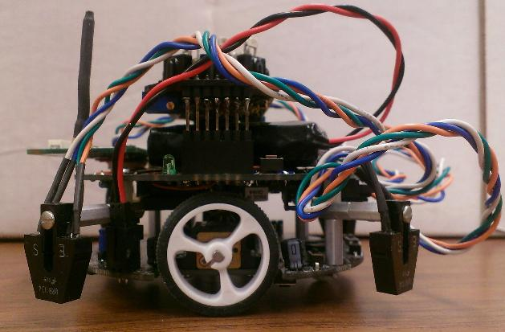
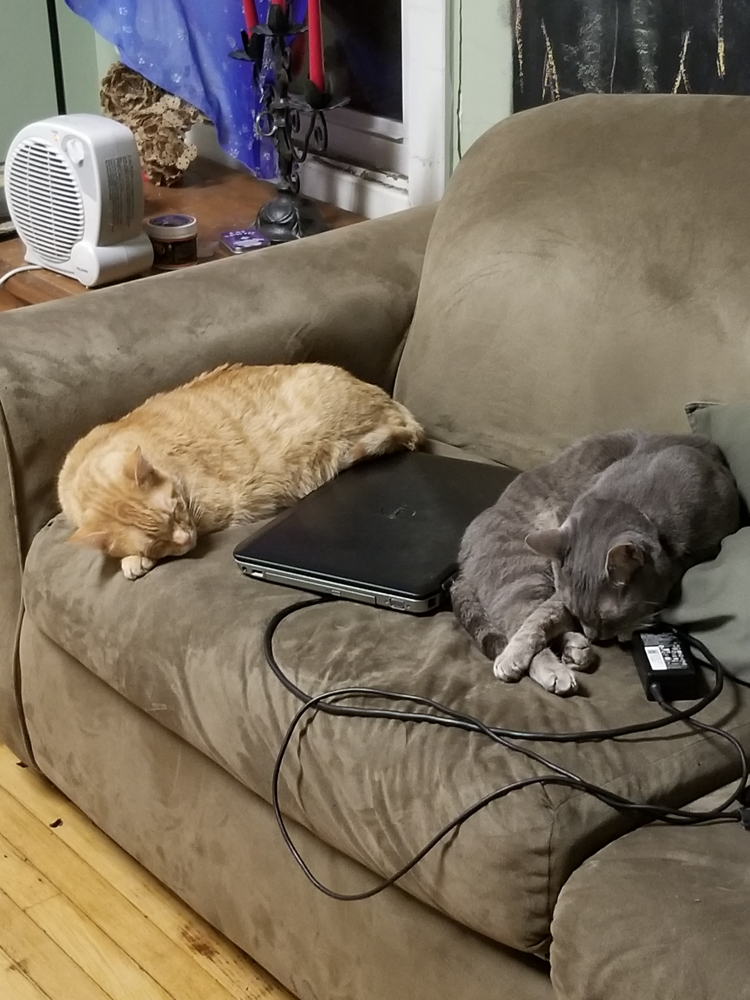
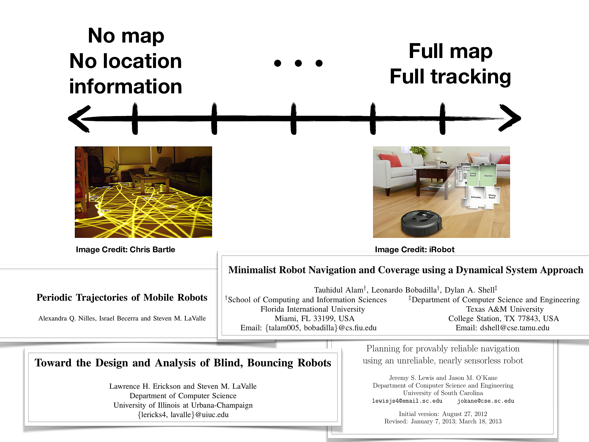
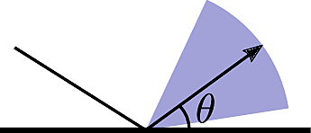
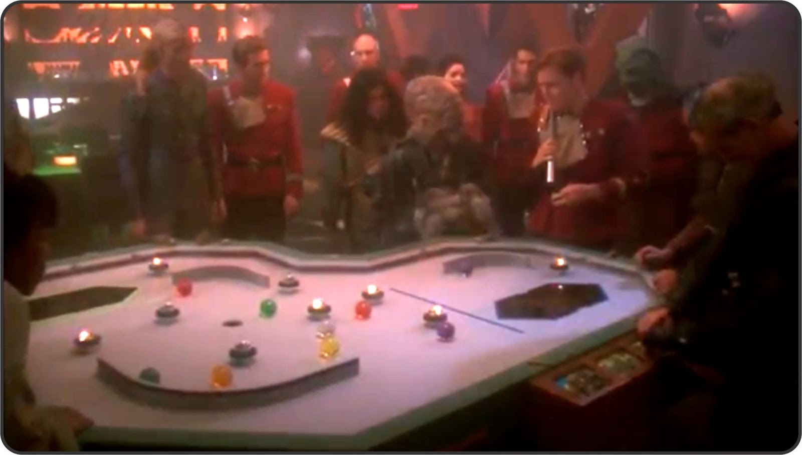
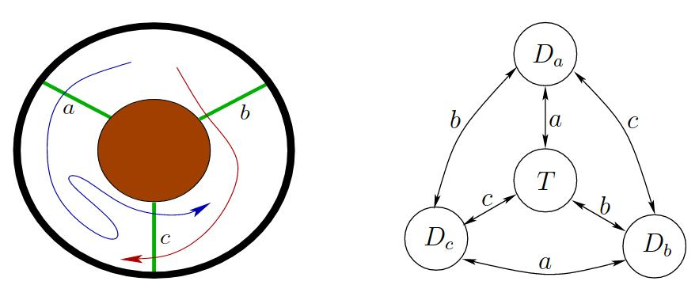
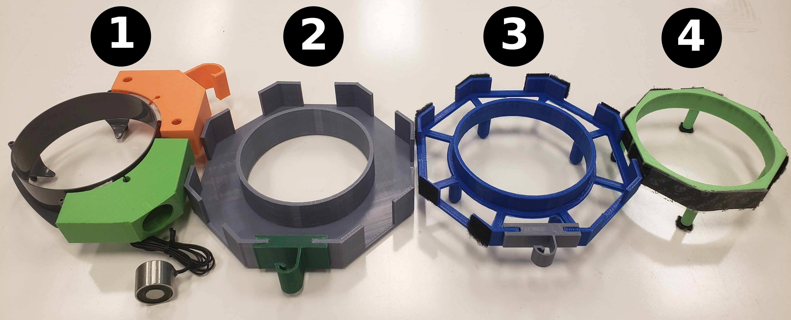
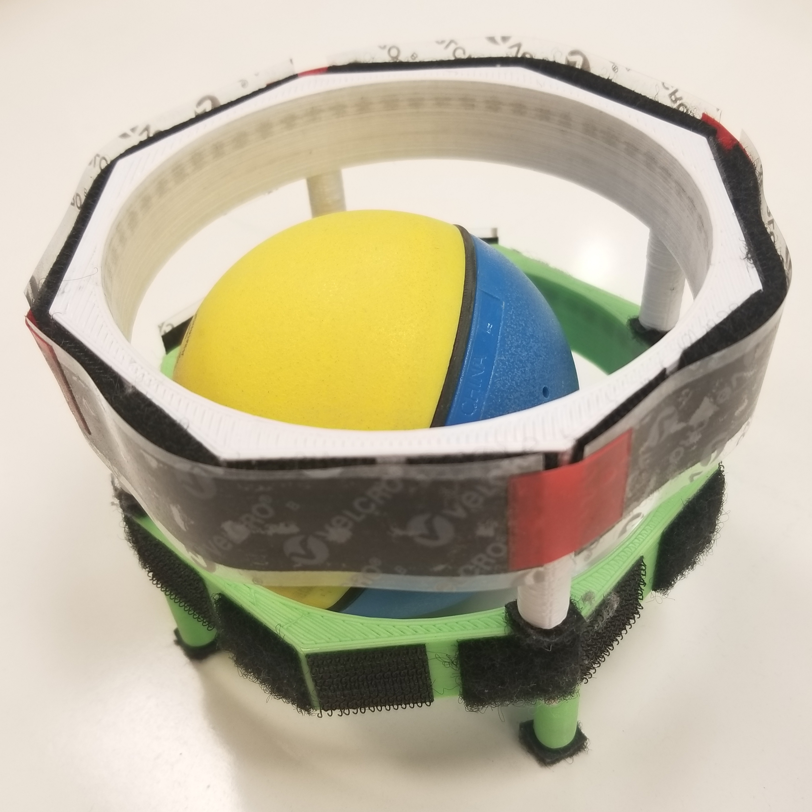
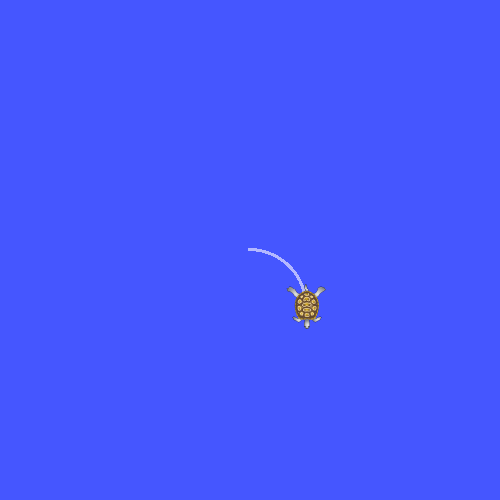
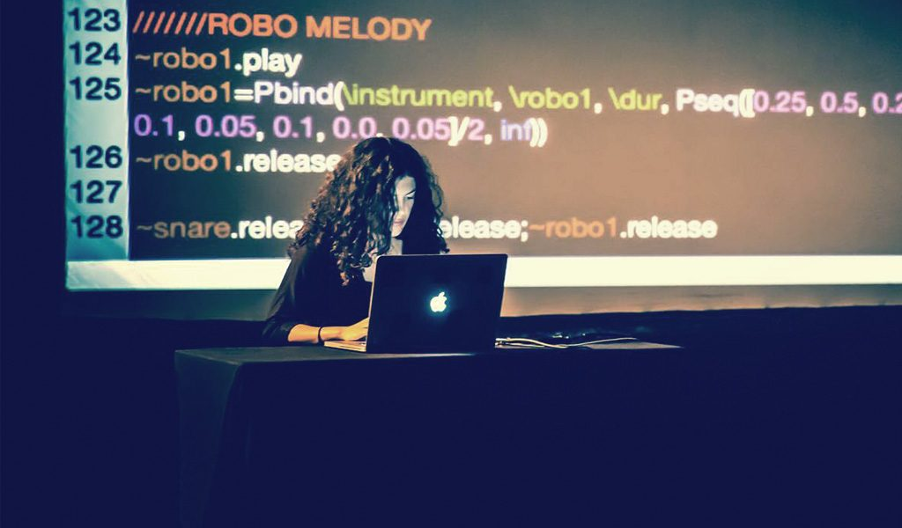

% Robust Robot Behaviors <br>from Simple Sensing and Motion Primitives
% Alli Nilles<br>17 April 2019


My Background
=============

From Physics to Robotics
------------------------


- 2011-2015: degree in Engineering Physics at Colorado School of Mines, Golden,
  CO

{width=400px} {width=300px}

. . .

> - Summer 2014: Research with Dr. Jim Crutchfield at UC Davis (Complexity Science Center)
> - What should be in the robot's "brain"?
> - Can we automatically partition sensor histories into states that are "good"
    at predicting future events?
> - How does environment structure relate to the structure of the robot's internal
    representation?

From Physics to Robotics
-------------

- Fall 2015: started PhD in Champaign-Urbana with Steve LaValle

. . .

{height=300px} {height=300px} {height=300px}

. . .

In Steve's past life, he worked on *minimalism* in robotics

(among many other things)
 

Minimalist Mobile Robots
------------------------


{width=750px class="center"}\


Inspiration
-----------

Source: Nicholas Valera, YouTube
[https://www.youtube.com/watch?v=D_7LZawC-Dw](https://www.youtube.com/watch?v=D_7LZawC-Dw)

<div align="middle" style="padding:12px">
<iframe width="600" height="500" class="center"
src="images/roomba.mp4"
frameborder="0" allowfullscreen>
</iframe></div>


How to Reason about Minimalist Robots?
------------------

If we don't get very much information from our sensors, we must reason about
sets of possible physical states...

. . .

**History information space**: all possible sequences of sensor observations

. . .

**Derived information states**: partitions of history information space
corresponding to useful robot states

. . .

A **plan** maps information states to actions the robot should take.

. . .

### "carve nature at its joints" -- Plato, allegedly ###

My Projects
-----------

Main questions:

1. How to design robust behaviors using minimal sensors and actuators?
2. What parts of the behavior design process can be formalized and automated?

. . .

Three case studies:

1. Bouncing robots
2. Wild bodies
3. Live coding of robot motion

<div class="center-text"> 

 
 


</div>

Bouncing Robots
===============

Motion Model
------------


Consider a point robot moving in a polygonal environment.

. . .

Ignore motion in interior of polygon (assume, for now, robot can move in
straight lines).

. . .

Robot can detect when it encounters a boundary, and can control rotation at the
boundary.

. . .

{width=700px}

**Bounce rule:** determines action $u \in (0, \pi)$ at boundary.

**Goal:** Plan over strategies of sequential **bounce rules**.

Questions
---------

> - Where can the robot go with just one bounce rule (or two, or three...)?
> - How can we make strategies robust to uncertainty?
> - What environment geometries are easy to navigate with this type of motion and what environments are hard?

Interesting Baseline Behaviors
------------------------------

Iterating the same rule can cause cycles and trapping regions:

{width=300px class="center"}

. . .

Combinatorial changes from small perturbations:

{width=300px class="center"}


#### First example inspired by Spagnolie, S. E., Wahl, C., Lukasik, J., & Thiffeault, J. L. (2017). Microorganism billiards. Physica D: Nonlinear Phenomena, 341, 33-44. ####


Understanding Cycles
--------------------

{width=450px class="center"}

Periodic Trajectories of Mobile Robots. A. Q. Nilles, I. Becerra, and S. M. LaValle. In IEEE Conference on Intelligent Robots and Systems (IROS), 2017.

What About Uncertainty?
-----------------------


{width=400px class="center"}

Uncertainty is unavoidable... Plan over **nondeterministic** bounce rules!

. . .

Actions are convex open sets $\tilde{\theta} \subseteq (0,\pi)$

**Safe actions**: *Any* action in $\tilde{\theta}$ from *anywhere* on 
edge $e_i$ will get you to *somewhere* on edge $e_j$.

. . .


**Goal:** along with plan, output a characterization of how much uncertainty the
plan can tolerate (design constraints!)


Geometry Influences Dynamics
----------------------------

We can write down transition function between intervals on
the boundary $\partial P$ under nondeterministic actions $\tilde{\theta}$:

$$f: \partial P \times U \to \partial P$$

. . .

**Observation:** $f$ is linear in position between pairs of mutually
straight edges.

. . .

**Observation:** in a single action, the robot can only transition to visible
segments of the boundary.

. . .

**Observation:** some state-action pairs are *contracting*, causing stable limit
cycles.


### Use geometric structure to discretize space of possible trajectories! ###


Our Approach
------------


> 1. Partition boundary using "visibility events"
> 2. Create *safe* edge-to-edge transition graph
> 3. Search for safe paths (navigation) and cycles (patrolling)
> 4. Translate paths to strategies

. . .

For more, see our paper...

A Visibility-Based Approach to Computing Nondeterministic Bouncing Strategies. A. Q. Nilles, Y. Ren, I. Becerra, S. M. LaValle. In the 13th Annual Workshop on the Algorithmic Foundations of Robotics, 2018.

What Can Do Now
----------------------

1. Check if a stable limit cycle exists for a given sequence of polygon edges.
2. Generate safe strategies between a start and goal region in any polygon.

. . .

### What we don't understand: ###

1. How to generate strategies that use stabilizing dynamics for navigation?
2. How to efficiently search through space of all limit cycles?
3. How to efficiently characterize reachable sets / limiting distributions?

{width=300px class="center"}


Next Steps
----------

> - Different model choices: curved paths, higher dimensions
> - Localization with simple sensors (laser beams)
> - Coverage with sampling sensors or cameras
> - Computational toolbox:
>   - stable and unstable manifolds for constant bounce strategies
>   - design tool: augment environment, robot?

. . .

{width=500px class="center"}


An Even More Minimal Robot?
===========================


Wild Bodies
---------------------

<div align="middle" style="padding:24px">
<iframe width="600" height="500" class="center"
src="images/large_weaselballs.mp4"
frameborder="0" allowfullscreen>
</iframe></div>


Information Spaces for Wild Bodies
----------------------------------

{width=700 class="center"}

. . .

We can **control** density of bodies on a per-room basis, using environment
design. [^1]

And we can **track** number of bodies per room, using laser beam placement. [^2]

[^1]: Stochastic modeling, control, and evaluation of wild bodies. D. E. Gierl, L. Bobadilla, O. Sanhcez, and S. M. LaValle. In IEEE International Conference on Robotics and Automation, 2014.

[^2]: Counting moving bodies using sparse sensor beams. L. E. Erickson, J. Yu, Y. Huang, and S. M. LaValle. IEEE Transactions on Automation Science and Engineering, 10(4):853--861, 2014.


What are these "uncontrollable" robots good for?
-----------------------------------------------

> - data collection in extreme environments such as space, remote wilderness, ocean
> - micro-scale robots for biological experiments and medical applications [^3] [^4]
>   - "active Brownian" and "Janus" particles can propel themselves!

. . .

Our platform could serve as a testbed for control approaches (easier to 
manufacture and observe than micro-scale particles)


[^3]: ETH Zurich, Department of Materials YouTube channel
[^4]: Li, Jinxing, et al. "Self-propelled nanomotors autonomously seek and repair cracks." Nano letters 15.10 (2015): 7077-7085.


Examples
--------

<div align="middle" style="padding:24px">
<iframe width="600" height="500" class="center"
src="images/vids_smaller.mp4"
frameborder="0" allowfullscreen>
</iframe></div>


Components of This Project
-----

> - **hardware** platform for experiments on control of active particle systems
> - **software** library for trajectory analysis and system design
> - **representations and filters** which are useful for scalable
    system control and monitoring

. . .

What tasks do we care about?

> - *coverage:* specify ensemble spatial density
> - *self-assembly:* specify desired distribution of shapes or sizes of assemblies
> - *rendezvous:* all robots meet somewhere, to share state, etc
> - *manipulation:* move or cluster objects in environment


Hub Design
----------

{width=700px class="center"}


{width=250px class="center"}


Particle Simulator
------------------


<div align="middle" style="padding:24px">
<iframe width="350" height="350"
src="images/collisions.mp4"
frameborder="0" allowfullscreen>
</iframe>
<iframe width="350" height="350"
src="images/ren9_1.mp4"
frameborder="0" allowfullscreen>
</iframe>
</div>


Control Ensemble, Not Individuals
---------------------------------

> - By controlling ensemble distributions of shapes and sizes, we can control ensemble dynamics.
> - Self-assembly (and disassembly) and collective manipulation do not have
to be independent tasks!
> - Smaller assemblies are faster, more mobile
> - Larger assemblies are less mobile, tend to be chiral, unless synchronized...

. . .

How to control ensemble from individual attach/detach rules?

Information States of Assembly
------------------------------


**Example 1: Counting Components** 

> - sensor: 
>    - $y = 1$ if a connection event happens
>    - $y = -1$ if a disconnection event happens

> - $\sum_i y_i = N$, the number of disconnected components at stage $i$


Information States of Assembly
------------------------------

**Example 2: "Pressure"**


$$ PV \propto nT $$

> - volume constant (fixed environment)
> - n known, or controllable
> - pressure is force exerted on environmental boundaries
> - "temperature" is a function of the characteristic velocities of the agents
>    - many, fast agents $\to$ high pressure
>    - fewer, slow agents $\to$ low pressure

. . .

Varied spatial "pressure" leads to manipulation through mechanical interactions

Toward Distributed Population Controllers
-----------------------------------------

Different equilibriums established from different rules for when to "detach".

$$ p(detach | Istate) = \quad ? $$

onboard information state choices:

> - time since last attachment
> - size of current assembly (requires local comms)
> - frequency of collisions
>    - over what time window?
>    - can we distinguish other robots from the environment?

. . .

system information state choices:

> - movement of objects (crossing beams)
> - "thermometer" or "pressure sensor" on walls or in certain regions


Next Steps
----------

> 1. Try different information spaces and see which correspond well with different modes of the system.
> 2. Change hub geometry to affect:
>     a. the spatial probability of attaching (directed self-assembly) [^5]
>     b. "scattering" interactions with walls (leave walls at more specific angle)

> 3. Design environment; funnels, asymmetries
> 4. Agents can influence environment to guide robot-robot interactions (stigmergy)? 

[^5]: Bhalla, N., Ipparthi, D., Klemp, E., & Dorigo, M. (2014, September). A geometrical approach to the incompatible substructure problem in parallel self-assembly. In International Conference on Parallel Problem Solving from Nature (pp. 751-760). Springer, Cham.

. . .

### Goal: find strategies that are robust to small differences in dynamics ###

### Rely more on coarse partition of agent behaviors (fast, slow, chirality, boundary interactions, etc) than on high-fidelity dynamical models ###


Programming Underactuated Robots
================================


Most Robot Programming Looks Like This
--------------------------------------

```python
if __name__ == '__main__':
    pub = rospy.Publisher('turtle1/cmd_vel',Twist)
    rospy.init_node('publisher_node')
    loop_rate = rospy.Rate(5)
    while not rospy.is_shutdown():
        vel=Twist()
        vel.linear.x = 1.0
        vel.angular.z = 1.0
        pub.publish(vel)
        loop_rate.sleep()
```

{width=300px class="center"}


Programming Patterns for Music
------------------------------

{width=600px class="center"}

```python
perk drums
pp ->         |z   v     z v   z   v     z v   |(1~2)/2^8^

I know it breaks your heart
Moved to the city in a broke-down car
```

\url{https://deerful.com}
\url{https://algorave.com}


Principles for Usability
------------------------

> - *Closeness of mapping*: "Ideally, the
problem entities in the user's task domain could be mapped directly onto
task-specific program entities, and operations on those problem entities would
likewise be mapped directly onto program operations" [^6]
> - *Diffuseness*: How many symbols or graphic entities are required to express a meaning?
> - *Error-proneness*: Does the design of the notation induce "careless mistakes"?
> - *Hard mental operations*: Are there places where the user needs to resort to  fingers or pencilled annotation to keep track of what's happening?
> - *Progressive evaluation*: Can a partially-complete program be executed to
obtain feedback on "How am I doing"?

[^6]: Green, T. R. G.; Petre, M. (1996). "Usability analysis of visual programming environments: A 'cognitive dimensions' framework". Journal of Visual Languages and Computing. 7: 131–174. CiteSeerX 10.1.1.22.1477. doi:10.1006/jvlc.1996.0009


Design Decisions
------------------------------

> - small set of motion primitives
> - small set of algebraic combinators (parallel, series composition)
> - small set of transformers (reverse, retrograde, repeat, reflect)
> - variable assignment
> - relative, not absolute, timing

. . .

### Operators are not tied to a specific platform ###

### Learn how to make patterns, not how to program a specific robot ###

### Usability vs. Expressivity vs. Performance ###

Live Coding
-----------

{width=700px class="center"}


Initial Prototype
-----------------

From 

```python
if __name__ == '__main__':
    pub = rospy.Publisher('turtle1/cmd_vel',Twist)
    rospy.init_node('publisher_node')
    loop_rate = rospy.Rate(5)
    while not rospy.is_shutdown():
        vel=Twist()
        vel.linear.x = 1.0
        vel.angular.z = 1.0
        pub.publish(vel)
        loop_rate.sleep()
```

to

```python
turtle1 $ forward || left
```

Demo
----

<div align="middle" style="padding:12px">
<iframe width="700" height="600" class="center"
src="images/improv_demo.mp4"
frameborder="0" allowfullscreen>
</iframe></div>

How to Measure Usability?
-------------------------

1. I think that I would like to use this system frequently.
1. I found the system unnecessarily complex.
1. I thought the system was easy to use.
1. I think that I would need the support of a technical person to be able to use this system.
1. I found the various functions in this system were well integrated.
1. I thought there was too much inconsistency in this system.
1. I would imagine that most people would learn to use this system very quickly.
1. I found the system very cumbersome to use.
1. I felt very confident using the system.
1. I needed to learn a lot of things before I could get going with this system.

. . .

Also measure creativity (number of attempts) during free time!

Next Steps
----------

> - extend to "weirder" robots: underactuated, nonholonomic
> - add sensors and **until** construct
> - add aesthetic choices (drone show)
> - integrate with a model checker to give feedback on feasibility of commands
> - add game mode where user is trying to complete a specific task (follow path
    through complex environment), compare directly with ROS Python API

Conclusion
==========

It's a Great Time to be an Academic Roboticist
------------------------------------


{width=750px class="center"}


Questions Remain About Safety and Robustness
--------------------------------------------

> - Design complexity is increasing exponentially
> - Lots of work in robotics on automated hardware design, but not many people are
    attacking the problem of how to design sensing and information processing
    systems
> - The robot body and its sensing requirements are **inextricably** linked

. . .

Sensor failures lead to tragedy...

What's Missing?
---------------

> 1. Deep understanding of how to characterize failure modes and validate systems
> 2. Computer-aided design of sensing and information processing systems
> 3. Usability and human comfort
> 4. Sustainability

. . .

How to make approaches and models from minimalist robotic systems relevant to
industrial systems?

. . .

Answer needs sociologists, politicians, regulators, economists, and
roboticists... As well as pressure from the public to prioritize safety over
fast deployment.


Thank you! Questions?
----------

{width=450px class="center"}


Acknowledgements: Samara Ren, Justin Wasserman, Austin Born, Chris Horn, John
Born, Chase Gladish, Jordan Parker, Dr. Amy LaViers, Dr. Yuliy Baryshnikov, Dr. Mattox Beckman, Dr. Steven M. LaValle


#### Presentation Template from https://github.com/PeterMosmans/presentation-template ####


