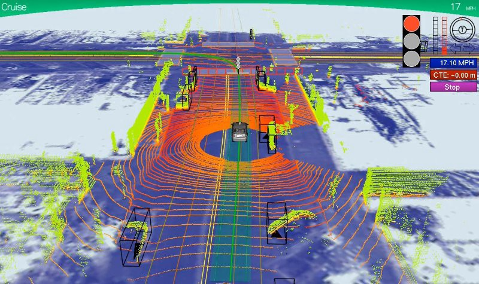
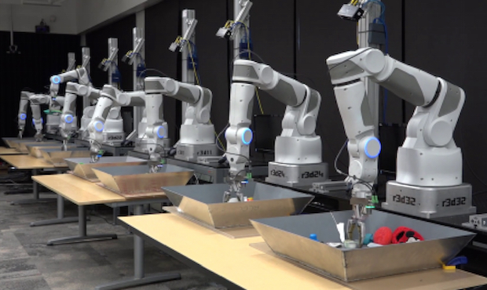
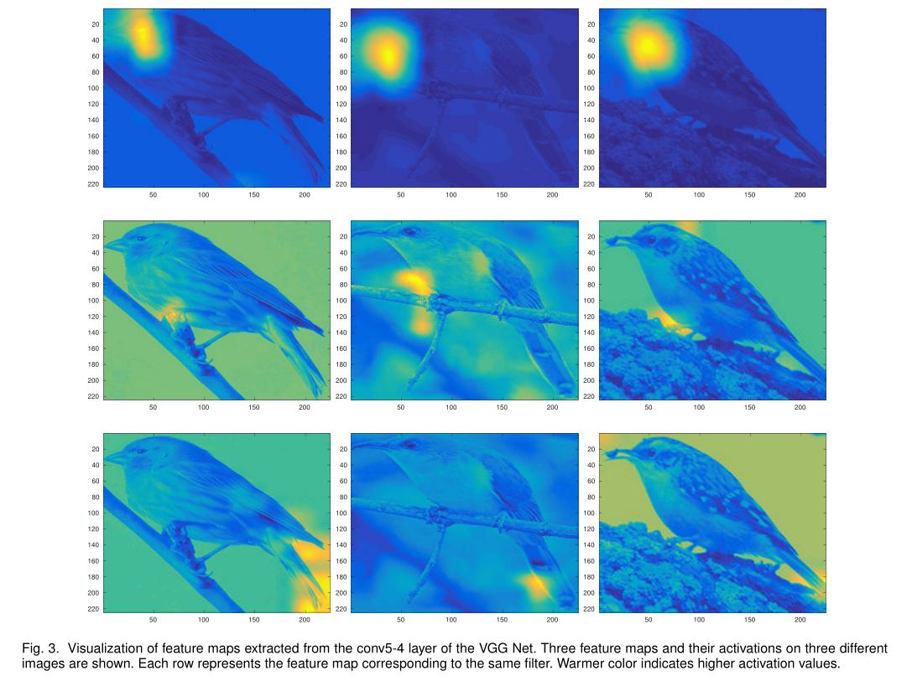
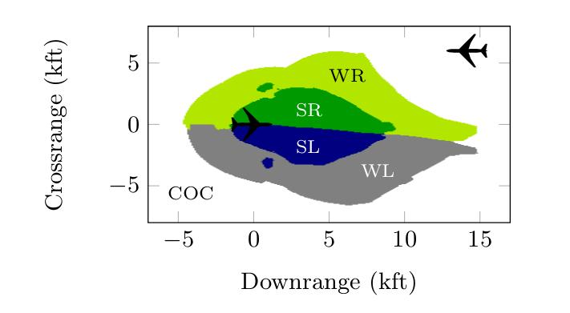
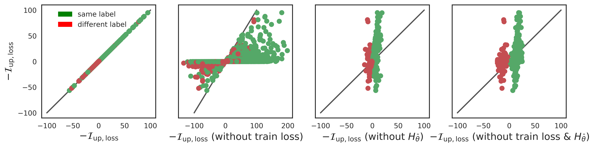
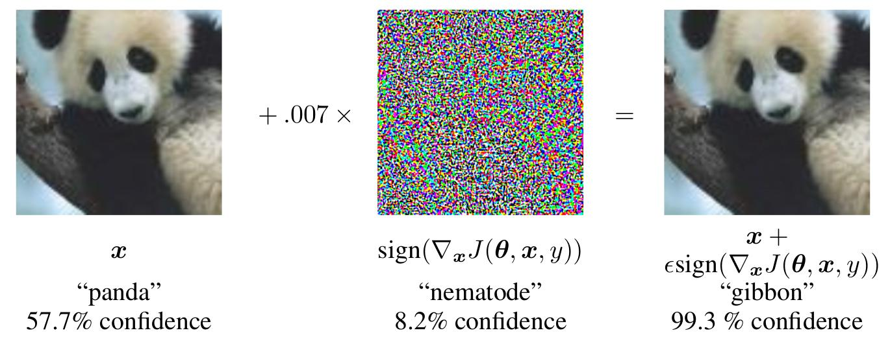
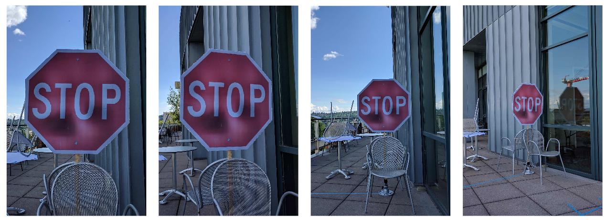
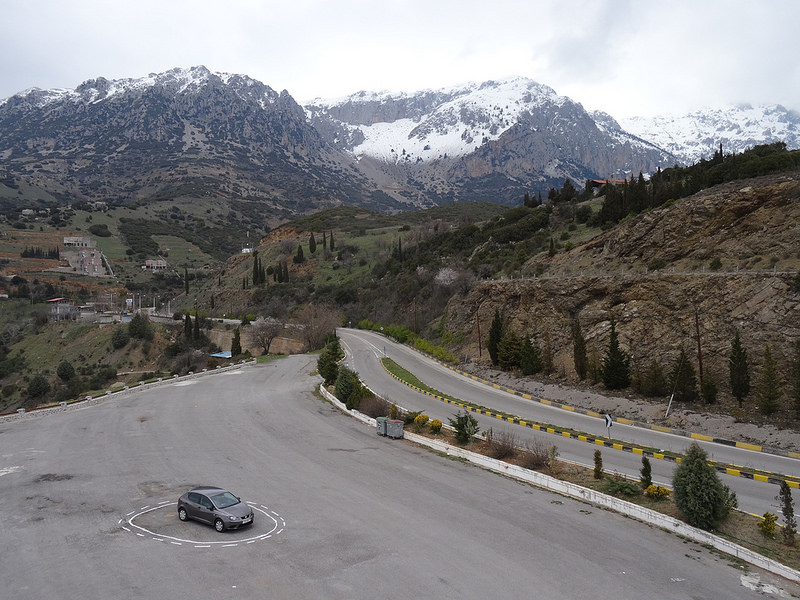

Outline
-------

> -   Brief overview of my research projects
> -   *Understanding Black Box Predictions via Influence Functions*
> -   *Generating Plans that Predict Themselves*

My Research
===========

Simple Mobile Robots
--------------------

> -   Mobile robots can vacuum floors, transport goods in warehouses, act as
    security, etc
    
    
\

Simple Mobile Robots
--------------------

> -   Mobile robots can vacuum floors, transport goods in warehouses, act as
    security, etc
> -   We want to **minimize** sensing, computation, actuation
>     -   make robots less expensive, more energy efficient
> -   Often, robots can bump into things and be ok!
> -   How can we use **contact with the environment** as a strategy or source of information?

. . .

\centering

{width=6cm}\

Blind, Bouncing Robots
----------------------

Model the robot a point moving in a planar environment, which:

> -   moves forward in straight lines until collision
> -   when in contact with boundary, rotates in place to some angle $\theta$, then moves
>     forward again

. . .

![In this environment, bouncing at the normal, the robot will become trapped
in the area between the purple lines [^5].](../figures/triangle_trap.jpg)

[^5]: [@bounce], ICRA 13

Research Questions
------------------
Given a constant control strategy, will the robot become "trapped" in a certain
motion pattern (attractor)?

. . .

We show that such a robot can perform the task of **patrolling**: periodically
following the same path.

\centering

{width=3.5cm}\ {width=3.5cm}\

Results
-------

> -   Periodic trajectories in regular polygons [@NilBecLav17], IROS 17
> -   Periodic trajectories in convex polygons (upcoming, with Israel Becerra, postdoc)
> -   Next steps: incorporate feedback control, and explore design space (other
    sensors, actuation strategies, etc), multiple robots, etc

\centering
{width=3.5cm}\ {width=3.5cm}\

Other Projects
-------------

\columnsbegin

\column{0.45\textwidth}

\footnotesize With Dr. Yuliy Baryshnikov: morphogenesis from local cell
reconfigurations. \tiny Figures from [@fletcher2014vertex] [@staveley]

\

\footnotesize Weaselball assemblies (undergradates run this project!)
\centering
{width=3cm}\

\column{0.55\textwidth}

\footnotesize Robot "live coding" language for ROS - with Chase Gladish, Drs. Amy LaViers, Mattox Beckman

\

\footnotesize Robot Design Game (RSS 17 Workshop)

{width=2cm}\ {width=2cm}\ {width=2cm}\

\columnsend

Understanding Black Box Predictions via Influence Functions
===========================================================

Motivation
----------

\centering
{width=5cm}\ {width=5cm}\ [^3]$^,$[^4]

. . .

> -   How can we interpret trained models, and perform sanity checks?
> -   How can we avoid possible training-set and test-set attacks?
> -   How robust are our models to noise?
> -   Strong need for quantitative analysis tools

[^3]: From Voyage Auto, "An Introduction to Lidar"
[^4]: From Google Research

Paper Contributions
-------------------

> -   A scalable implementation of influence functions, parameterized over loss
      function
> -   Evidence of usefulness for
>     -   model understanding
>     -   generating adversarial training examples
>     -   debugging domain mismatch
>     -   fixing mislabeled examples

. . .

> "otherwise high-performing models are still difficult to debug and fail
> catastrophically in the presence of changing data distributions and
> adversaries... it is critical to build tools to help us make machine learning
> more reliable 'in the wild.'" -- Percy Liang

Much more work remains to be done! This is an analysis tool - what to do with
results of analysis?

Context: Influence Functions
------------

> -   1980s: robust statistics: Cook, Weisberg *Residuals and influence in regression*
>     -   focused on linear models, exact solutions
> -   2004: *Robustness of Convex Risk Minimization Models* [@christmann2004robustness]
>       -   $n=500$, SVM with different kernels, focus on effect of adding a data point
> -   2016: *"Influence Sketching": Finding Influential Samples In Large-Scale Regressions* [@wojnowicz2016influence]
>       -   randomized algorithm for approximating Cook's Distance (effect of
>           deleting sample on linear model)
>       -   $n=2$ million

Context: Interpretability and Verification
-------------------------

-   Examine activation patterns for different inputs

. . .

\centering
{width=8cm}\ [^10]

[^10]: [@liu2016cross], Liu et. al. 2016

Context: Interpretability and Verification
-------------------------

> -   Examine activation patterns for different inputs
> -   Qualitative explanations (*"Why Should I Trust You?"* [@ribeiro2016should])
> -   Prove invariants about predictions on subsets of input space (*"Reluplex:
>     An Efficent SMT Solver for Verifying Deep Neural Networks"* [@reluplex])

. . .

\centering
{height=3cm}\

A Different Approach
--------------------

Instead of treating the model as **fixed**, treat the
model as a **function of the training data**.

. . .

Explore the **marginal effect** of each data point.

. . .

Get **quantitative** measure of *influence.*

Problem Formulation
-------------------

What does it mean for a training point to be *influential*?

. . .

For a given learned model (with known loss function):

> -   How would the model's predictions change if we **omit** a specific
    training point?
> -   How would the model's predictions change if we **perturb** a specific
    training point?

. . .

To approach these questions, study the *derivative* of the *loss* with respect
to perturbation of a single training point.

. . .

When this value is larger, that training point is more *influential*.

Definitions
-------------------

predictor$: \mathcal{X} \to \mathcal{Y}$

. . .

given training points $z_1, \ldots, z_n$, where $z_i \in \mathcal{X} \times \mathcal{Y}$

. . .

trained parameters $\theta \in \Uptheta$

. . .

loss $L(z, \theta)$ and empirical risk $R(\theta) = \frac{1}{n} \sum_{i=1}^n L(z_i, \theta)$

-   approach is agnostic to loss (but assumes convex, twice-differentiable wrt $\theta$)
-   Hessian $H_{\hat{\theta}}  =  \frac{1}{n} \sum_{i=1}^{n} \nabla_{\theta}^2 L(z_i, \hat{\theta})$

. . .

empirical risk minimizer $\hat{\theta} = \arg\min_{\theta\in\Uptheta} R(\theta)$

Influence
---------

We want to find change in model parameters if training point $z$ is removed, but we don't want to
retrain!

. . .

Instead, weight $z$ by $\epsilon$:

$$ \hat{\theta}_{\epsilon, z} = \arg\min_{\theta\in\Uptheta} \frac{1}{n}
\sum_{i=1}^n L(z_i, \theta) + \epsilon L(z,\theta) $$

. . .

Define influence as:

$$
\mathcal{I}_{\hat{\theta}}(z)  =  \frac{d \hat{\theta}_{\epsilon, z}}{d \epsilon}
$$

$$
\frac{d\hat\theta_{\epsilon,z}}{d\epsilon}\Bigr|_{\substack{\epsilon = 0}} = -H_{\hat\theta}^{-1} \nabla L(z, \hat\theta)
$$

Removing and Perturbing Training Points
---------------------------------------

Propagate to find influence on loss:

\begin{align*}
\mathcal{I}_{L}(z, z_{test})
&  =  \frac{d L(z_{test},\hat{\theta}_{\epsilon,z})}{d\epsilon} \Bigr|_{\substack{\epsilon = 0}} \\
& = -\nabla_\theta L(z_\text{test}, \hat\theta) ^\top H_{\hat\theta}^{-1} \nabla_\theta L(z,\hat\theta)
\end{align*}

**this will be our working definition**

. . .

We can also measure the influence of perturbing the **value** of a training input, $z_{\delta} =
(x+\delta, y)$:

. . .

\begin{align}
\label{eqn:inflinput-discrete}
\frac{d\hat\theta_{\epsilon, z_\delta, -z}}{d\epsilon}\Bigr|_{\substack{\epsilon = 0}} &=
\mathcal{I}_{\hat{\theta}}(z_\delta)
-\mathcal{I}_{\hat{\theta}}(z) \nonumber\\
&= -H_{\hat\theta}^{-1} \big(\nabla_\theta L(z_\delta, \hat\theta) - \nabla_\theta L(z, \hat\theta) \big).
\end{align}

Analysis - Remove Terms from Influence
--------------------------------------

Let $p(y \mid x) = \sigma(y \theta^\top x)$, with $y \in \{-1, 1\}$ and
$\sigma(t) = \frac{1}{1 + \exp(-t)}$. 

. . .

For a training point $z=(x,y)$,

\begin{align*}
L(z, \theta)               &= \log (1 + \exp(-y \theta^\top x)) \\
\nabla_\theta L(z, \theta) &= -\sigma(-y \theta^\top x) yx \\
H_\theta                   &= \frac{1}{n} \sum_{i=1}^n \sigma(\theta^\top x_i) \sigma(-\theta^\top x_i) x_i x_i^\top
\end{align*}

. . .

and $\mathcal{I}_{L}(z, z_\text{test})$ is

\begin{align*}
-y_\text{test} y \cdot \sigma(-y_\text{test} \theta^\top x_\text{test}) \cdot \sigma(-y \theta^\top x) \cdot x_\text{test}^\top H_{\hat\theta}^{-1} x.
\end{align*}

Analysis - Remove Terms from Influence
--------------------------------------

Let $p(y \mid x) = \sigma(y \theta^\top x)$, with $y \in \{-1, 1\}$ and
$\sigma(t) = \frac{1}{1 + \exp(-t)}$. 

For a training point $z=(x,y)$,

\begin{align*}
L(z, \theta)               &= \log (1 + \exp(-y \theta^\top x)) \\
\nabla_\theta L(z, \theta) &= -\sigma(-y \theta^\top x) yx \\
H_\theta                   &= \frac{1}{n} \sum_{i=1}^n \sigma(\theta^\top x_i) \sigma(-\theta^\top x_i) x_i x_i^\top
\end{align*}

and $\mathcal{I}_{L}(z, z_\text{test})$ is

\begin{align*}
-y_\text{test} y \cdot \sigma(-y_\text{test} \theta^\top x_\text{test}) \cdot \sigma(-y \theta^\top x) \cdot
\mathbf{x_{test}^\top} H_{\hat\theta}^{-1} \mathbf{x}.
\end{align*}

Analysis - Remove Terms from Influence (Fig 1)
--------------------------------------

\begin{align*}
-y_\text{test} y \cdot \sigma(-y_\text{test} \theta^\top x_\text{test}) \cdot \sigma(-y \theta^\top x) \cdot x_\text{test}^\top H_{\hat\theta}^{-1} x.
\end{align*}

\centering

{height=3cm}\

{height=3cm}\

Efficiency
----------

Two challenges:

> 1. Forming and inverting $H_{\hat{\theta}} = \frac{1}{n} \sum_{i=1}^n \nabla^2_{\theta} L(z_i, \hat{\theta})$
>     -   $n$ training points, $\theta \in \R^p$ requires $\mathcal{O}(np^2 + p^3)$ ops
> 2. Often want to calculate influence across all training points for a specific
> test point

How to Make Faster?
----------

Overall approach:

> -   Efficiently approximate $s_{test} =
      H_{\hat{\theta}}^{-1} \nabla_{\theta} L(z_{test}, \hat{\theta})$
> -   Use this to efficiently compute $\mathcal{I}_{L}(z, z_{test})$ by just multiplying
      $s_{test}$ by $\nabla_{\theta} L(z, \theta)$ as needed!

. . .

**Conjugate Gradients + Stochastic Estimation** ([@agarwal2016second], Agarwal
2016)

Both automatically handled in systems like TensorFlow, Theano - users just
specify $L$.

Speeds up calculating influence for all training points on a given test point to
$\mathcal{O}(np)$.

When Does it Break?
========================

Influence matches leave-one-out retraining
----------

Non-differentiable losses
-------------------------

What to Use it For?
===================

Understanding Model Behavior
----------------------------

{width=7cm}

Adversarial Training Examples
-----------------------------

\vspace{-1em}

$$
\mathcal{I}_{pert, loss}(z, z_{test})
= - \nabla_{\theta} L(z_{test}, \hat{\theta})^{\top}
H_{\hat\theta}^{-1} \nabla_x \nabla_\theta L(z, \hat\theta)
$$

Background: Adversarial Test Examples
-----------------------------

 [^8]

[^8]: [@goodfellow2014explaining] Goodfellow et. al. 2014

Background: Adversarial Test Examples
-------------------------------------

 [^9]

[^9]: [@evtimov2017robust] Evtimov et. al. 2017

Domain Mismatch
------------

> -   20,000 patients, 3 out of 24 children under 10 were re-admitted
> -   filter out 20 of these children who were not re-admitted, train
> -   "child" feature coefficient was 15/127 in magnitude
> -   calculate influence on all training points for mis-labeled child
>     -   four children were 30-40x more influential than other training examples

Fixing Mislabeled Examples
--------------------------

Conclusion
----------

Why Best Paper?

-   Quantitative analysis tool for evaluating training sets
-   Connects statistical technique with large-scale applications
-   Usable "out of the box": code and datasets available,
    parameterized over loss

Conclusion
----------

What could be better / remaining questions?

> -   Still not applicable to every "black box": many nonconvex,
>     non-differentiable architectures
> -   Comparisons between pixel space and feature space
> -   Should analyze nonconvexity and nonconvergence separately, not together.
> -   How to make datasets uniformly influential?
> -   Multiclass classification?
> -   Does not account for relationships between training points: removing a
>     subset of the training set vs. just one point

Thank you!
---------

\centering

Appendix
========

Sketch of Derivation
--------------------

We want to find change in model parameters if training point $z$ is removed, but we don't want to retrain

Instead, weight $z$ by $\epsilon$:

$$ \hat{\theta}_{\epsilon, z} = \arg\min_{\theta\in\Uptheta} \frac{1}{n}
\sum_{i=1}^n L(z_i, \theta) + \epsilon L(z,\theta) $$

. . .

With $\Updelta_{\epsilon} = \hat{\theta}_{\epsilon, z} - \hat{\theta}$, we can
calculate influence as:

$$
\mathcal{I}_{\hat{\theta}}(z)  =
\frac{d \hat{\theta}_{\epsilon, z}}{d \epsilon} = 
\frac{d \Updelta_{\epsilon, z}}{d \epsilon}
$$ 

Sketch of Derivation
--------------------

$\hat{\theta}_{\epsilon, z}$ minimizes $R(\theta) + \epsilon L(z,\theta)$:

\vspace{-1em}
$$ 0 = \nabla R(\hat{\theta}_{\epsilon,z}) + \epsilon \nabla L(z,
\hat{\theta}_{\epsilon, z}) $$

. . .

Taylor expand the right hand side around $\hat{\theta}$

\vspace{-1em}
\begin{align*}
  0 \approx & \nabla R(\hat\theta) + \epsilon \nabla L(z, \hat\theta) + \\
  & \nabla^2 R(\hat\theta) + \epsilon \nabla^2 L(z, \hat\theta) \Updelta_\epsilon  \\
\end{align*}

. . .

\vspace{-1em}
and solve for $\Updelta_{\epsilon}$

\vspace{-1em}
\begin{align*}
\Updelta_{\epsilon} \approx & [ -\nabla^2 R(\hat\theta) + \epsilon \nabla^2 L(z,\hat\theta) ]^{-1} \\
& \nabla R(\hat\theta) + \epsilon \nabla L(z, \hat\theta) \\
\end{align*}

Sketch of Derivation
--------------------

But $\nabla R(\hat\theta) = 0$.
Keeping only $O(\epsilon)$ terms, we have
\begin{align*}
  \Updelta_\epsilon \approx & -\nabla^2 R(\hat\theta)^{-1} \nabla L(z, \hat\theta) \epsilon.
\end{align*}

. . .

We conclude that:
\begin{align*}
  \frac{d\hat\theta_{\epsilon,z}}{d\epsilon}\Bigr|_{\substack{\epsilon = 0}} &= -H_{\hat\theta}^{-1} \nabla L(z, \hat\theta) \\
  & =  \mathcal{I}_{\hat{\theta}}(z).
\end{align*}

## References

\tiny
