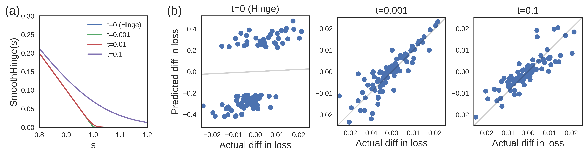

Outline
-------

> -   Brief overview of my research projects
> -   *Understanding Black Box Predictions via Influence Functions*
>     -  what is "influence"?
>     -  validation
>     -  applications
> -   *Generating Plans that Predict Themselves*
>     -  defining what makes a plan $t$-predictable
>     -  instantiation and experiments

My Research
===========

Simple Mobile Robots
--------------------

> -   Mobile robots can vacuum floors, transport goods in warehouses, act as
    security robots (patrol), etc
> -   We want to **minimize** sensing, computation, actuation
>     -   make robots less expensive, more energy efficient
> -   Often, robots can bump into things and be ok!
> -   How can we use **contact with the environment** as a strategy or source of information?

\centering

{width=6cm}\

Blind, Bouncing Robots
----------------------

Restrict the robot motion to:

> -   moving forward in straight lines until collision
> -   when in contact with boundary, rotate in place to some angle $\theta$, then move forward again

![In this environment, bouncing at the normal, the robot will become trapped
in the area between the purple lines [^1].](../figures/triangle_trap.jpg)

[^1]: [@bounce], ICRA 13

Research Questions
------------------

Given a constant control strategy, will the robot become "trapped" in a certain
motion pattern (attractor)?

. . .

We show that such a robot can perform the task of **patrolling**: periodically
following the same path.

\centering

{width=3.5cm}\ {width=3.5cm}\

Results
-------

> -   limit cycles in regular polygons [@NilBecLav17, IROS 17]
> -   limit cycles in convex polygons (upcoming, with Israel Becerra, postdoc)
> -   next steps: incorporate feedback control, and explore design space (other
    sensors, actuation strategies, etc), multiple robots, etc

. . .

\centering
{width=3.5cm}\ {width=3.5cm}\

Other Projects
-------------

\columnsbegin

\column{0.45\textwidth}

\footnotesize With Dr. Yuliy Baryshnikov: morphogenesis from local cell
reconfigurations. \tiny Figures from [@fletcher2014vertex] [@staveley]

\

\footnotesize Weaselball assemblies (undergradates run this project!)
\centering
{width=3cm}\

\column{0.55\textwidth}

\footnotesize Robot "live coding" language for ROS - with Chase Gladish, Drs. Amy LaViers, Mattox Beckman

\

\footnotesize Robot Design Game (RSS 17 Workshop)

{width=2cm}\ {width=2cm}\ {width=2cm}\

\columnsend

Understanding Black Box Predictions via Influence Functions
===========================================================

Motivation
----------

\centering
{width=5cm}\ {width=5cm}\ [^3]$^,$[^4]

> -   How can we interpret trained models, and perform sanity checks?
> -   How can we avoid possible training-set and test-set attacks?
> -   How robust are our models to noise?
> -   Strong need for quantitative analysis tools

[^3]: From Voyage Auto, "An Introduction to Lidar"
[^4]: From Google Research

Paper Contributions
-------------------

> -   A scalable implementation of influence functions, parameterized over loss
      function
> -   Evidence of usefulness for model understanding, generating adversarial
      training examples, debugging domain mismatch, and fixing mislabeled examples

. . .

Much more work remains to be done! This is an analysis tool - what to do with
results of analysis?

Context and Related Work
------------

> -   statistics: Cook, Weisberg 1980: *Residuals and influence in regression*
>     -   focused on linear models, exact solutions
> -   *Robustness of Convex Risk Minimization Models* [@christmann2004robustness]
>       -   $n=500$, SVM with different kernels, focus on effect of adding a data point
> -   *Model selection in kernel based regression using the influence function* [@debruyne2008model]
> -   *"Influence Sketching": Finding Influential Samples In Large-Scale Regressions* [@wojnowicz2016influence]
>       -   randomized algorithm for approximating influence, specific to
>           generalized linear models. $n=2$ million
> -   adversarial examples and training-set attacks

Background
----------

-   Pang Wei Koh, and his advisor Percy Liang
-   Stanford and Microsoft Research
-   ICML 2017 Best Paper Award

> "otherwise high-performing models are still difficult to debug and fail
> catastrophically in the presence of changing data distributions and
> adversaries... it is critical to build tools to help us make machine learning
> more reliable 'in the wild.'" -- Percy Liang

Problem Formulation
-------------------

What does it mean for a training point to be *influential*?

. . .

For a given learned model (with known loss function):

> -   How would the model's predictions change if we **omit** a specific
    training point?
> -   How would the model's predictions change if we **perturb** a specific
    training point?

. . .

To approach these questions, study the *derivative* of the *optimal parameters*,
or of the *loss*, with respect to different perturbations of a single training
point.

. . .

When this value is larger, that training point is more *influential*.

Definitions
-------------------

predictor$: \sX \to \sY$

. . .

given training points $z_1, \ldots, z_n$, where $z_i \in \sX \times \sY$

. . .

trained parameters $\theta \in \Uptheta$

. . .

loss $L(z, \theta)$ and empirical risk $R(\theta) = \frac{1}{n} \sum_{i=1}^n L(z_i, \theta)$

-   approach is agnostic to loss (but assumes convex, twice-differentiable wrt $\theta$)
-   we will often use $H_{\hat{\theta}} \eqdef \frac{1}{n} \sum_{i=1}^{n} \nabla_{\theta}^2 L(z_i, \hat{\theta})$

. . .

empirical risk minimizer $\hat{\theta} = \arg\min_{\theta\in\Uptheta} R(\theta)$

Removing and Perturbing Training Points
---------------------------------------

Similar methods can derive the following:

\begin{align*}
\sI_{L}(z, z_{test})
& \eqdef \frac{d L(z_{test},\hat{\theta}_{\epsilon,z})}{d\epsilon} \Bigr|_{\substack{\epsilon = 0}} \\
& = -\nabla_\theta L(z_\text{test}, \hat\theta) ^\top H_{\hat\theta}^{-1} \nabla_\theta L(z,\hat\theta)
\end{align*}

which measures influence on the loss, not just the parameters.

. . .

We can also measure the influence of perturbing the **value** of a training input, $z_{\delta} =
(x+\delta, y)$:

. . .

\begin{align}
\label{eqn:inflinput-discrete}
\frac{d\hat\theta_{\epsilon, z_\delta, -z}}{d\epsilon}\Bigr|_{\substack{\epsilon = 0}} &=
\sI_{\hat{\theta}}(z_\delta)
-\sI_{\hat{\theta}}(z) \nonumber\\
&= -H_{\hat\theta}^{-1} \big(\nabla_\theta L(z_\delta, \hat\theta) - \nabla_\theta L(z, \hat\theta) \big).
\end{align}

Analysis - Remove Terms from Influence
--------------------------------------

Let $p(y \mid x) = \sigma(y \theta^\top x)$, with $y \in \{-1, 1\}$ and
$\sigma(t) = \frac{1}{1 + \exp(-t)}$. 

. . .

For a training point $z=(x,y)$,

\begin{align*}
L(z, \theta)               &= \log (1 + \exp(-y \theta^\top x)) \\
\nabla_\theta L(z, \theta) &= -\sigma(-y \theta^\top x) yx \\
H_\theta                   &= \frac{1}{n} \sum_{i=1}^n \sigma(\theta^\top x_i) \sigma(-\theta^\top x_i) x_i x_i^\top
\end{align*}

. . .

and $\sI_{L}(z, z_\text{test})$ is

\begin{align*}
-y_\text{test} y \cdot \sigma(-y_\text{test} \theta^\top x_\text{test}) \cdot \sigma(-y \theta^\top x) \cdot x_\text{test}^\top H_{\hat\theta}^{-1} x.
\end{align*}

Analysis - Remove Terms from Influence
--------------------------------------

Let $p(y \mid x) = \sigma(y \theta^\top x)$, with $y \in \{-1, 1\}$ and
$\sigma(t) = \frac{1}{1 + \exp(-t)}$. 

For a training point $z=(x,y)$,

\begin{align*}
L(z, \theta)               &= \log (1 + \exp(-y \theta^\top x)) \\
\nabla_\theta L(z, \theta) &= -\sigma(-y \theta^\top x) yx \\
H_\theta                   &= \frac{1}{n} \sum_{i=1}^n \sigma(\theta^\top x_i) \sigma(-\theta^\top x_i) x_i x_i^\top
\end{align*}

and $\sI_{L}(z, z_\text{test})$ is

\begin{align*}
-y_\text{test} y \cdot \sigma(-y_\text{test} \theta^\top x_\text{test}) \cdot \sigma(-y \theta^\top x) \cdot
\mathbf{x_{test}^\top} H_{\hat\theta}^{-1} \mathbf{x}.
\end{align*}

Analysis - Remove Terms from Influence
--------------------------------------

\begin{align*}
-y_\text{test} y \cdot \sigma(-y_\text{test} \theta^\top x_\text{test}) \cdot \sigma(-y \theta^\top x) \cdot x_\text{test}^\top H_{\hat\theta}^{-1} x.
\end{align*}

\

**left:** $\sigma(-y \theta^\top x)$ gives points with low training loss less 
    influence: without it, we overestimate the influence of training points

Analysis - Remove Terms from Influence
--------------------------------------

\begin{align*}
-y_\text{test} y \cdot \sigma(-y_\text{test} \theta^\top x_\text{test}) \cdot \sigma(-y \theta^\top x) \cdot x_\text{test}^\top H_{\hat\theta}^{-1} x.
\end{align*}

\

**middle/right:** the weighted covariance matrix $H_{\hat\theta}^{-1}$ measures the
    "resistance" of the other training points to the removal of $z$. Without it,
    all same-label points are helpful, all opposite-label points are harmful.

Efficiency
----------

Two challenges:

1. Forming and inverting $H_{\hat{\theta}} = \frac{1}{n} \sum_{i=1}^n \nabla^2_{\theta} L(z_i, \hat{\theta})$
    -   $n$ training points, $\theta \in \R^p$ requires $\mathcal{O}(np^2 + p^3)$ ops
2. Often want to calculate influence across all training points for a specific
test point

How to Make Faster?
----------

Overall approach:

> -   Efficiently approximate $s_{test} \eqdef
      H_{\hat{\theta}}^{-1} \nabla_{\theta} L(z_{test}, \hat{\theta})$
> -   Use this to efficiently compute $\sI_{L}(z, z_{test})$ by just multiplying
      $s_{test}$ by $\nabla_{\theta} L(z, \theta)$ as needed!

. . .

**Conjugate Gradients** 

**Stochastic Estimation**

Both automatically handled in systems like TensorFlow, Theano - users just
specify $L$.

Speeds up calculating influence for all training points on a given test point to
$\mathcal{O}(np)$.

How to Know if it Works?
========================

Validation: Influence matches leave-one-out retraining
----------

![**Left:** For each of the 500 training
points with largest influence, we plotted
$-\frac{1}{n} \cdot \sI_{L}(z, z_\text{test})$ against the actual change in
test loss after removing that point and retraining. The inverse HVP was solved
exactly with CG. **Mid:** Same, but with the stochastic approximation.
**Right:** The same plot for a CNN, computed on the 100 most influential
points with CG. For the actual difference in loss, we removed each point and
retrained from $\tilde \theta$ for 30k steps](../figures/fig-approx.png)

Non-differentiable losses
-------------------------

\

-   SVM with hinge loss
    -   approximate with $smoothHinge(s,t) = t \log(1+\exp(\frac{1-s}{t}))$
-   set derivative at hinge to 0, lose second derivative information
-   t=0.001, Pearson's R=0.95
-   t=0.1, Pearson's R=0.91

What to Use it For?
===================

Understanding Model Behavior
----------------------------

{width=7cm}

Adversarial Training Examples
---------------------------------

Conclusion
----------

-   Why Best Paper?
    -   Connects statistical technique with large-scale applications
    -   Relatively usable "out of the box": code and datasets available,
        parameterized over loss
    -   Addresses important question for safety-critical systems
-   What could be better / remaining questions?
    -   Analysis of CNN example still leaves questions: How to linearize loss?
        How to apply to other architectures?
    -   Should analyze nonconvexity and nonconvergence separately, not together.
    -   How to make datasets uniformly influential?

Now For Something Completely Different!
=======================================

Robots!
-------

\centering
{width=\textwidth}\

Challenges in Robotics
----------------------

-   We have low-level planning mostly figured out (thanks Steve!)
    -   Even in real time: see, dynamic replanning, *Robot Motion Planning on a
        Chip*
-   More than ever, robots "just work" (but don't ask me to demo)
-   Now, we can focus on the hugely important problem of human-robot interaction

Robots and Humans, Working Together!
------------------------------------

# Thank you! {.standout}

Appendix
========

Sketch of Derivation
--------------------

We want to find change in model parameters if training point $z$ is removed, but we don't want to retrain

Instead, weight $z$ by $\epsilon$:

$$ \hat{\theta}_{\epsilon, z} = \arg\min_{\theta\in\Uptheta} \frac{1}{n}
\sum_{i=1}^n L(z_i, \theta) + \epsilon L(z,\theta) $$

. . .

With $\Updelta_{\epsilon} = \hat{\theta}_{\epsilon, z} - \hat{\theta}$, we can
calculate influence as:

$$ \sI_{\hat{\theta}}(z) \eqdef \frac{d \hat{\theta}_{\epsilon, z}}{d \epsilon} = 
\frac{d \Updelta_{\epsilon, z}}{d \epsilon} $$ 

Sketch of Derivation
--------------------

$\hat{\theta}_{\epsilon, z}$ minimizes $R(\theta) + \epsilon L(z,\theta)$:

\vspace{-1em}
$$ 0 = \nabla R(\hat{\theta}_{\epsilon,z}) + \epsilon \nabla L(z,
\hat{\theta}_{\epsilon, z}) $$

. . .

Taylor expand the right hand side around $\hat{\theta}$

\vspace{-1em}
\begin{align*}
  0 \approx & \pb{\nabla R(\hat\theta) + \epsilon \nabla L(z, \hat\theta)} + \\
  & \pb{\nabla^2 R(\hat\theta) + \epsilon \nabla^2 L(z, \hat\theta)} \Updelta_\epsilon  \\
\end{align*}

. . .

and solve for $\Updelta_{\epsilon}$

\vspace{-1em}
\begin{align*}
  \Updelta_\epsilon \approx & -\pb{\nabla^2 R(\hat\theta) + \epsilon \nabla^2 L(z, \hat\theta)}^{-1} \\
  & \pb{\nabla R(\hat\theta) + \epsilon \nabla L(z, \hat\theta)}. \nonumber
\end{align*}

Sketch of Derivation
--------------------

But $\nabla R(\hat\theta) = 0$.
Keeping only $O(\epsilon)$ terms, we have
\begin{align*}
  \Updelta_\epsilon \approx & -\nabla^2 R(\hat\theta)^{-1} \nabla L(z, \hat\theta) \epsilon.
\end{align*}

. . .

We conclude that:
\begin{align*}
  \frac{d\hat\theta_{\epsilon,z}}{d\epsilon}\Bigr|_{\substack{\epsilon = 0}} &= -H_{\hat\theta}^{-1} \nabla L(z, \hat\theta) \\
  &\eqdef \sI_{\hat{\theta}}(z).
\end{align*}

## References  {.allowframebreaks}

\tiny
