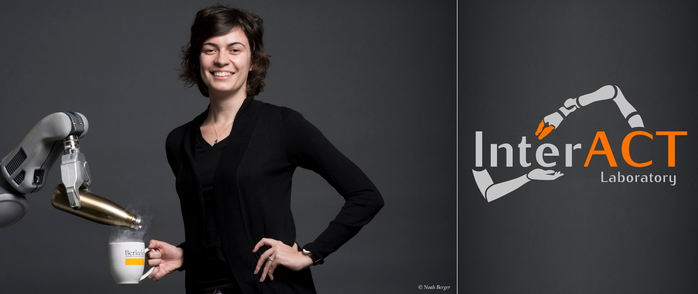
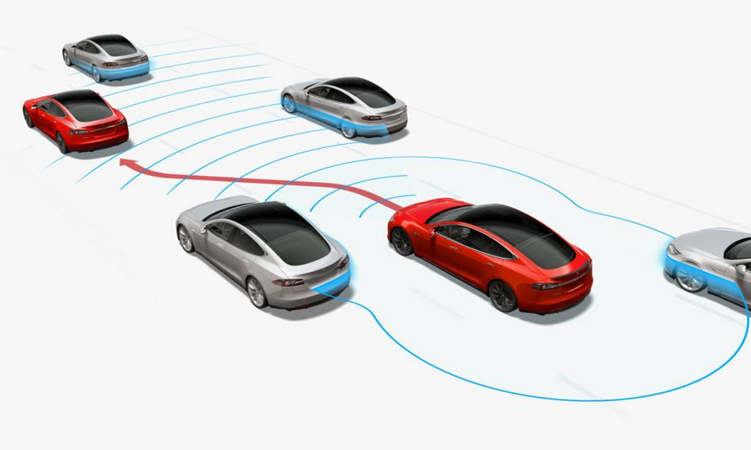
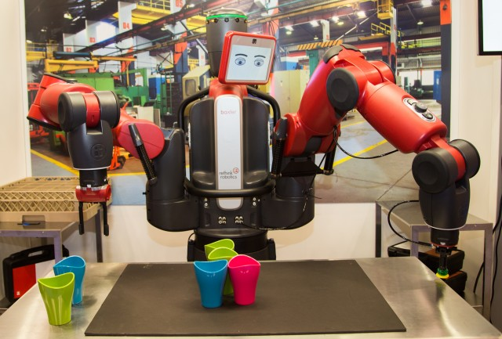
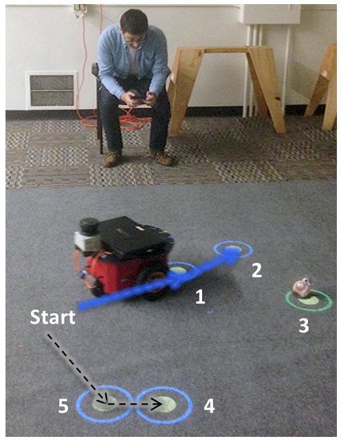
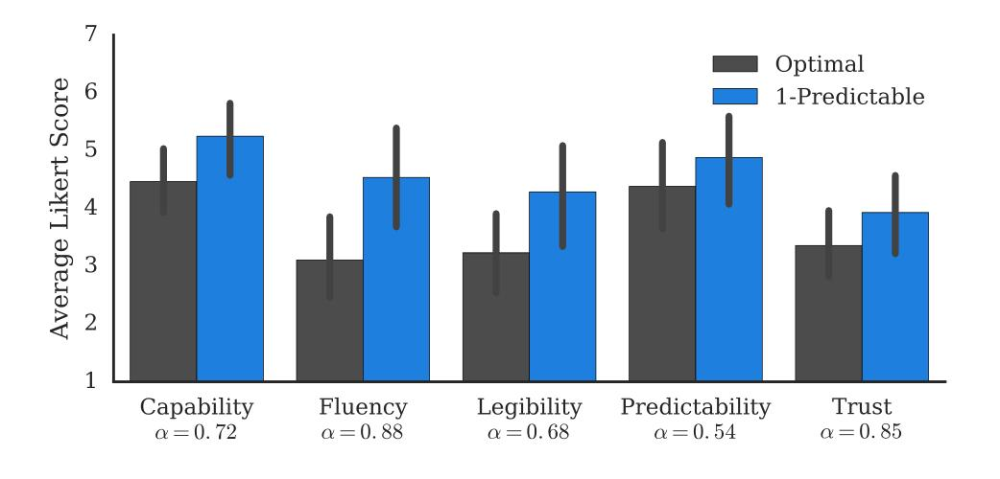
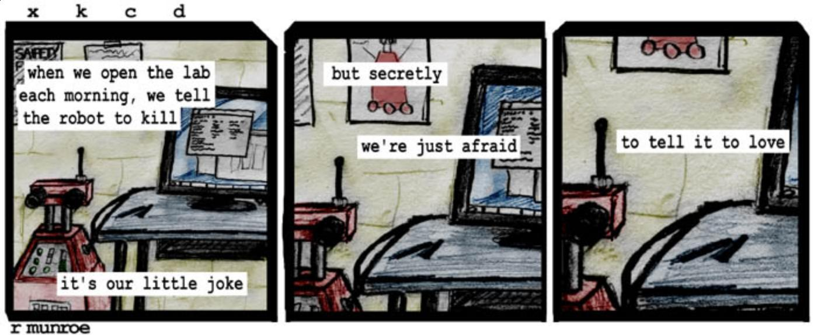

Challenges in Robotics
----------------------

> -   We have low-level planning mostly figured out
>     -   Even in real time: dynamic replanning, *Robot Motion Planning on a
>         Chip*
> -   More than ever, robots "just work"
> -   Now, how to make robots work *with humans*?

. . .

\

Why Do We Care?
---------------

\centering
\ {width=6cm}\ 

[^6]$^,$ [^7]

[^6]: Gear Patrol
[^7]: US DOL

What is Needed?
---------------

A better notion of what is **optimal**: encode models of human cognition into our planners and controllers!

Background
----------

Task Planning: planning over a finite, often discrete, series of *actions*

. . .

May include jointly doing state estimation, motion planning, etc [^1], but here
we assume the actions "just work"

. . .

[^1]: See Leslie Kaelbling's talk next week!

{height=3cm}\ {height=3cm}\

Background: Communicating Through Action
----------------------------

> -   predictability vs. legibility [^11]
> -   explicability [^12]
> -   expressiveness: Amy LaViers RAD Lab [^13]

HRI started in 2006, with 147 attendees, and in 2015 had 364
attendees

135/834 IROS 2016 papers had "human" in the title or keywords

[^11]: [@dragan2013legibility], Dragan et al 13 HRI
[^12]: [@zhang2017plan], Zhang et al 17 ICRA
[^13]: [@bai2016design], Bai, Dahl, LaViers 16 IROS

Approach
--------

> -   Need computable model of what humans predict robots will do after
>     observing the robot and knowing the task
> -   Given this, we can estimate the probability that a human will be able to
>     predict *the rest of a robot's plan*, given the goal and the first $t$ steps
>     of the robot's plan
> -   Optimize plans so that the first $t$ steps make the rest of the plan
>     maximally predictable

Definitions
-----------

**t-predictability**

: given a feasible plan $a = (a_1, \ldots, a_T)$, *t-predictability* is
the probability that an observer can correctly infer $(a_{t+1}, \ldots, a_T)$
after observing $(a_1, \ldots, a_t)$ and knowing the goal $G$.

: $\mathcal{P}_t(a) = P(a_{t+1}, \ldots, a_T | S, G, a_1, \ldots, a_t)$

. . .

**t-predictable planner**

: a planner which generates the plan maximizing t-predictability out of all
feasible plans. 

: $a^*$ such that $a^* = \arg\max_{a \in \mathcal{A}} \mathcal{P}_t(a)$

How Do Humans Predict What Robots Will Do?
------------------------------------------

For "waypoint visiting" task, assume humans will predict shortest path with some
noise.

path length cost $c : \mathcal{A} \times \mathcal{S} \times \mathcal{G} \to \R^+$

\begin{equation*}
P(\bm{a} | S,G) = \frac{e^{-\beta c(\bm{a}, S, G)}}{\sum_{\tilde{a} \in
\mathcal{A}} e^{-\beta c(\tilde{a}, S, G)}}
\end{equation*}

$\beta > 0$, set to 1 for both experiments

Optimization Using This Model
-----------------------------

\begin{equation*}
\bm{a^*} = \arg\max_{\bm{a}\in\mathcal{A}}
\frac{
e^{-\beta c(\bm{a}_{t+1:T}, S^t_{\bm{a}}, G)}
}{
\sum_{\tilde{a}_{t+1:T} \in \mathcal{A}^t_{\bm{a}}} e^{-\beta
c(\tilde{a}_{t+1:T}, S^t_{\bm{a}}, G)}
}
\end{equation*}

Where we assume cost is linearly separable, and factor out $e^{-\beta
c(\bm{a}_{1:t}, S, S^t_{\bm{a}})}$ from the top and bottom expressions.

. . .

**Search** over all $\bm{a}_{1:t}$ and find $\bm{a}_{t+1:T}$ which is **most
predictable**.

. . .

Use branch-and-bound technique to reduce from factorial to exponential time.

t-Predictability
----------------

![Sample $t=0,1,2$-predictable trajectories, and their theoretical
predictability. Figure 2 from [@fisac2016generating]](../figures/tpredict_compare.jpg){width=11cm}

Online Experiment
-----------------

**Training Phase:** click on targets, guiding human avatar to visit all targets
with the shortest path

. . .

> primes people to think of shortest path: influences how they may predict what
> the robot does

. . .

**Experimental Phase:** watch robot visit $k = 0, 1, 2$ targets. Then click on
targets to predict which ones robot will visit next. Then show robot's actual
path.

Environment Generation
----------------------

Create 270 randomly generated layouts with five or six targets.

. . .

Eliminate environments where optimal sequence is the same for all planners: down
to 176 layouts.

. . .

> This planner is **most useful** in ambiguous settings

\centering
{height=2cm}\  {height=2cm}\

Results
-------

**Model Validity:** high correlation ($r=0.87$) between theoretical
predictability and participant accuracy

. . .

All hypotheses (mostly) supported:

**H1:** When showing 1 target, the 1-predictable robot will result in lower
error than the optimal baseline (similar for 2 targets).

. . .

**H2:** The error rate will be lowest when $t$ equals the number of targets
shown, $k$.

. . .

**H3:** The percieved performance of the robots will be highest when $t=k$.

Results
-------

![Error rate and Levenshtein distance for user-predicted paths in online
experiment. Figure 4 in [@fisac2016generating].](../figures/online_results.jpg)

Preferences
-----------

![User preferences over time. Figure 5 in [@fisac2016generating].](../figures/tpredict_preferences.jpg)

. . .

> "This robot mostly starts out in the worst way and then goes in weird
> directions but eventually starts to make sense."

In-Person Experiments
---------------------

\centering

Results
-------

**H1:** The 1-predictable robot will result in more successful trials than the
optimal baseline.

> 1-predictable robot leads to more successful completions ($z=3.34$,
> $p<0.001$)

\vspace{-1em}

**H2:** Users will prefer working with the 1-predictable robot.

> 86% of participants prefer the predictable robot

\vspace{-1em}

. . .

{width=10cm}

Contributions
-------------

> - first step toward making predictable *action sequences*, not just
>   predictable goals
>       -   very important for safety and comfort!
> - statistically significant evidence that this planner affects how humans
>   predict what robots will do
> - collaboration with psychologists, thorough statistical analysis of
>   experiments

Limitations
-----------

> -   Difficult to model human predictions for more complicated tasks
>     -   People have different cultural expectations of how to complete tasks (such as
>         cooking)
>     -   Does not address "learning curve": people are also modelling how the
>         robot works!
> -   Tractability: need to compute over all possible remaining action sequences
> -   In-person experiment is narrow in scope (but needs to be, to show effects
>     of planner)

Possible Extension to Motion Planning
-------------------------------------

\columnsbegin

\column{0.5\textwidth}

> - want a trajectory $\xi$ from start $S$ to goal $G$
> - approximation requires maximizing the determinant of the Hessian
> - instead, could integrate with homotopy-aware path sampling techniques

\column{0.5\textwidth}

. . .

![Sample paths generated for the robot (red disk) avoiding the obstacles
(black shapes). Figure 13 in *Real-Time Informed Path Sampling for Motion
Planning Search* by Ross Knepper and Matt Mason, IJRR 2012
[@knepper2012real]](../figures/path_sampling.jpg){height=4cm}

\columnsend

Thank you!
-------

\centering
{width=11cm}\

## References

\tiny
