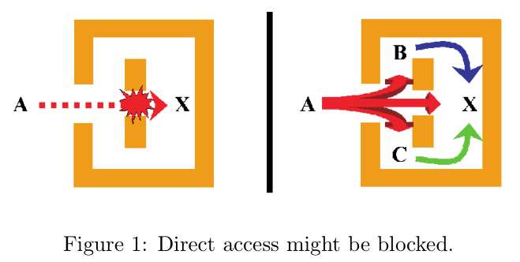
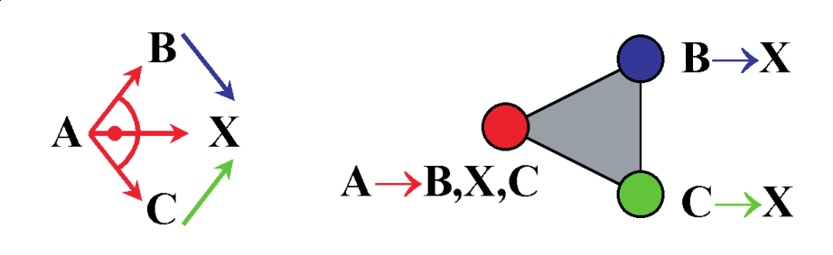
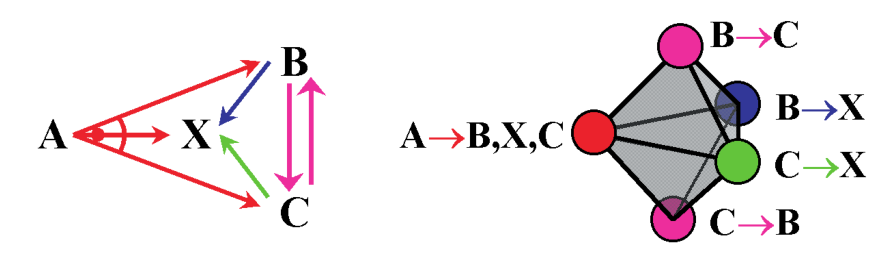
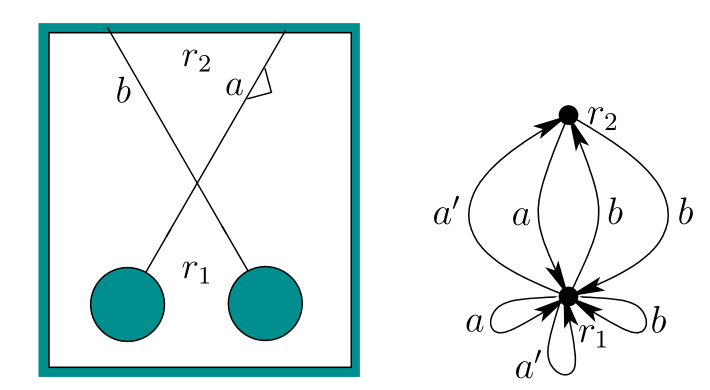
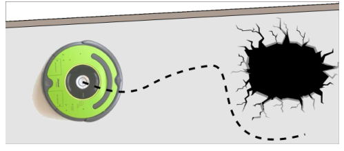

---
title: New Developments in Combinatorial Data Structures and Algorithms for Robotic Planning, Filtering, and Design
theme: Pittsburgh
colortheme: beaver
header-includes:
	- \usepackage{svg}
	- \usepackage{jeffe}
author: Alli Nilles
date: October 3, 2016
...

Roadmap
-------

1.  Background on Combinatorics in Robotics

    i) Erdmann's topology of discrete strategies

2.  "Procrustean" Graphs

    i)  Definition
    i)  Planning Problems, Plans and Filtering
    i)  Homomorphic p-graphs
    i)  Label transformations

Discrete Information Spaces
---------------------------

-   Information Spaces [^1] [^3]
    -   Actions ($u \in U$), sensor data ($y \in Y$) and initial conditions
        ($\eta_0$) define the $history$ information state at stage $k$:

        $\eta_k = (\eta_{k-1}, u_{k-1}, y_k)$
    -   Other information spaces (state estimation, etc) are all derived from
        the history I-space

[^1]: LaValle: Planning Algorithms
[^3]: LaValle: Sensing and Filtering. Foundations and Trends in Robotics,
  2012.

Combinatorial Planning
----------------------

-   Can plan over I-space: robot actions are state transitions
-   In general, we want to traverse a nondeterministic graph from start state(s)
    to goal state(s)
-   Add logic $\to$ LTL
-   Add probability distributions $\to$ Markov chains, POMDPs
-   Add diff EQs $\to$ hybrid automata

Generalization using Topology [^2]
-----------------------------

{width=8cm}\

{width=8cm}\

[^2]: Erdmann: On the topology of discrete strategies. IJRR, 2010.

Generalization using Topology
-----------------------------

{width=8cm}\

-   Strategy avoids cycles $\leftrightarrow$ tetrahedron
-   Can a strategy reach a goal from all possible start nodes?
    -   add "loopback" edges from goal to all other nodes
    -   resulting simplex is homotopic to either sphere (strategy exists) or
        point (no such strategy)

Useful results
--------------

-   Erdmann: "A system can reach any state in a graph with control uncertainty
    if and only if the graph's strategy complex is homotopic to a sphere of
        dimension two less than the number of states in the graph."
-   Many proofs in NFA representation have topological proofs
-   Maybe easier to answer some questions in graph representation, like...

Combinatorial Filtering
-----------------------

How does sensor data partition our state graph?

$h: X \to Y$

$h\inv{}(y) = \{ x \in X : h(x) = y \}$

\center

{width=8cm}\

-   Think of sensor as a labelling - possibly overlapping - on state transition
graph
-   NP-complete to automatically reduce filters [^4]

[^4]: O'Kane, Shell: Automatic reduction of combinatorial filters. ICRA 2013.

Other relevant questions
------------------

-   How can we reason about sensor transformations?
-   Planning and filtering have a lot in common. Can we make a general data
    structure?

-   In Greek mythology, Procrustes was a rogue smith and bandit from Attica who
physically attacked people by stretching them or cutting off their legs, so as
to force them to fit the size of an iron bed.
-   Procrustean is thus used to describe situations where different lengths or sizes
or properties are fitted to an arbitrary standard.

We want to separate interpretation (plan, filter, etc) from representation.

Procrustean Graphs
------------------

Edge labelled bipartite directed graphs with:

-   Vertex set $V = V_u \cup V_y$, action and observation vertices
-   Edges from $v \in V_u$ labelled with set of actions, lead to $w \in V_y$
-   Edges from $v \in V_y$ labelled with set of observations, lead to action
    vertices
-   non-empty set $V_0$, initial states, exclusively action or observation
    states

Intuition: very general data structure that reflects the agent-based behavior.
Can only act or observe, not both simultaneously.

Observations are "actions" taken by nature.

Example
-------

\center

{width=8cm}\

Definitions
-----------

-   **event**: observation or action
-   **execution**: a sequence $e_1 \ldots e_k$ of events that represent valid
    transitions to some $w \in V$, starting from some $v \in V_0$
-   **safe**: P-graph $G$ is safe on p-graph $W$ if for every joint execution $E
    = e_1 \ldots e_k$ on $G$ and $W$:
    -   for every $(v,w) \in V(G) \times V(W)$ that are the results of $E$ being
        executed on $G$ and $W$, from any start states, we have:
        1.  if $v$ is an action state, then for every outgoing edge $e$ and
            every $u \in U(e)$, there exists an edge $e'$ in $W$ originating at
            $w$, for which $u \in U(e)$
        2.  if $v$ is an observation state, then for every outgoing edge $e'$
            from $w \in W$ and every $y \in U(e)$, there exists an edge $e \in
            G$ originating at $v$, for which $y \in Y(e)$.

Intution: if $G$ is safe on $W$, $G$ never executes an action that is not
allowed by $W$, and can react correctly to any observation that $W$ admits.

State-Determined Presentation
-----------------------------

Form where label sets on all outgoing edges are disjoint.

Results in deterministic path through graph for each execution.

\columnsbegin
\column{.5\textwidth}

\column{.5\textwidth}
\columnsend
