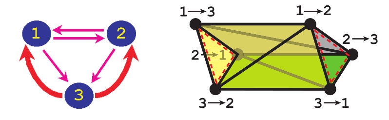
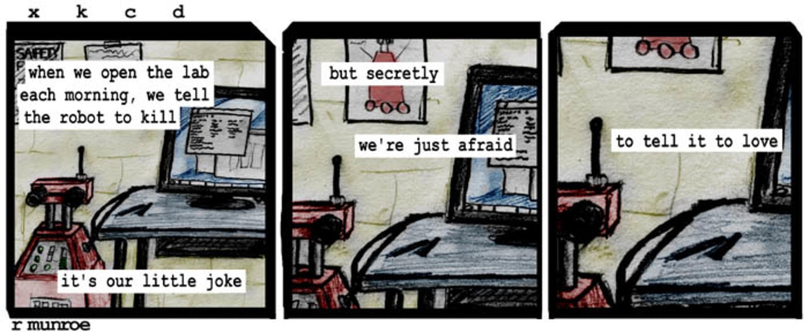

---
title: New Developments in Combinatorial Data Structures and Algorithms for Robotic Planning, Filtering, and Design
theme: Pittsburgh
colortheme: beaver
header-includes:
	- \usepackage{svg}
	- \usepackage{jeffe}
author: |
    | Alli Nilles
    | Advisor: Steve LaValle
...

Roadmap
-------

1. Selected background on discrete models in robotics

1. Erdmann's topology of discrete strategies

    i)  Given a task and strategy, what can we say about the attainability of
    the task?

2.  "Procrustean" graphs

    i)  Definition
    i)  Planning problems, plans and filtering
    i)  Homomorphic p-graphs
    i)  Label transformations

But Why Discrete Models?
------------------------

-   Sensors, actuators, inherently discrete
-   Configuration / phase space can often be discretized naturally as well
    -   Example: manipulation

Discrete Information Spaces [^1] [^3]
---------------------------

-   Actions ($u \in U$), sensor data ($y \in Y$) and initial conditions
    ($\eta_0$) define the $history$ information state at stage $k$:
    $\eta_k = (\eta_{k-1}, u_{k-1}, y_k)$
-   History I-space is space of all possible history information states
-   Other information spaces (state estimation, etc) are all derived from
    the history I-space

[^1]: LaValle: Planning Algorithms
[^3]: LaValle: Sensing and Filtering. Foundations and Trends in Robotics,
  2012.

Combinatorial Planning
----------------------

-   Can plan over I-space: robot actions are state transitions
-   In general, we want to traverse a nondeterministic graph from start state(s)
    to goal state(s)
-   Add logic $\to$ LTL/CTL
-   Add probability distributions $\to$ Markov chains, POMDPs
-   Add diff EQs $\to$ hybrid automata

But are graphs always the best representation?

Generalization using Topology [^2]
-----------------------------

\center

{width=8cm}\

{width=8cm}\

[^2]: Erdmann: On the topology of discrete strategies. IJRR, 2010.

Generalization using Topology
-----------------------------

\center

{width=8cm}\

-   Strategy avoids cycles $\leftrightarrow$ tetrahedron
-   Can go backwards: "every finite simplicial complex can be realized via some
    nondeterministic graph" [^2]
-   Can a strategy reach a goal from all possible start nodes?

Loopback Graphs and Complexes
-----------------------------

-   add "loopback" edges from goal to all other nodes
-   resulting simplex is homotopic to either sphere (strategy exists) or
    point (no such strategy)
    -   generate in "almost reasonable polynomial time"
-   "A system can reach any state in a graph with control uncertainty if and
    only if the graph's strategy complex is homotopic to a sphere of dimension
    two less than the number of states in the graph."

\center

{width=8cm}\

Robotics is Hard
----------------

-   Given stochastic graph, determining size of smallest stochastically
    attainable goal is NP-complete (\textsc{IndepSet})

Sometimes, impossible...

-   Algorithmically impossible to recognize the homeomorphism or homotopy type
    of a finite general simplicial complex
-   Therefore, finding the smallest graph whose strategy complex is homotopic to
    a given complex is uncomputable
-   Bad news for canonical representations, analyzing repercussions

Takeaways
---------

-   Many proofs in directed graph representation have topological proofs
-   I need to learn more topology
-   Maybe easier to answer some questions in graph representation, like...

Combinatorial Filtering
-----------------------

How does sensor data partition our state graph?

$h: X \to Y$

$h\inv{}(y) = \{ x \in X : h(x) = y \}$

\center

{width=8cm}\

-   Think of sensor as a labelling - possibly overlapping - on state transition
graph
-   NP-complete to automatically reduce filters [^4]

[^4]: O'Kane, Shell: Automatic reduction of combinatorial filters. ICRA 2013.

Other relevant questions
------------------

-   Planning and filtering have a lot in common. Can we make a general data
    structure?
-   How can we reason about sensor transformations?

-   In Greek mythology, Procrustes was a rogue smith and bandit from Attica who
physically attacked people by stretching them or cutting off their legs, so as
to force them to fit the size of an iron bed.
-   Procrustean is thus used to describe situations where different lengths or sizes
or properties are fitted to an arbitrary standard.

We want to separate interpretation (plan, filter, etc) from representation.

Procrustean Graphs
------------------

Edge labelled bipartite directed graphs with:

-   Vertex set $V = V_u \cup V_y$, action and observation vertices
-   Edges from $v \in V_u$ labelled with set of actions, lead to $w \in V_y$
-   Edges from $v \in V_y$ labelled with set of observations, lead to action
    vertices
-   non-empty set $V_0$, initial states, exclusively action or observation
    states

*Intuition*: very general data structure that reflects the agent-based behavior.
Can only act or observe, not both simultaneously.

Observations are "actions" taken by nature.

Example
-------

\center

{width=8cm}\

Definitions
-----------

-   **event**: observation or action
-   **execution**: a sequence $e_1 \ldots e_k$ of events that represent valid
    transitions to some $w \in V$, starting from some $v \in V_0$
-   **safe**: P-graph $G$ is safe on p-graph $W$ if for every joint execution $E
    = e_1 \ldots e_k$ on $G$ and $W$:
    -   for every $(v,w) \in V(G) \times V(W)$ that are the results of $E$ being
        executed on $G$ and $W$, from any start states, we have:
        1.  if $v$ is an action state, then for every outgoing edge $e$ and
            every $u \in U(e)$, there exists an edge $e'$ in $W$ originating at
            $w$, for which $u \in U(e)$
        2.  if $v$ is an observation state, then for every outgoing edge $e'$
            from $w \in W$ and every $y \in U(e)$, there exists an edge $e \in
            G$ originating at $v$, for which $y \in Y(e)$.

*Intuition*: if $G$ is safe on $W$, $G$ never executes an action that is not
allowed by $W$, and can react correctly to any observation that $W$ admits.

Plans
-----

-   **Plan**: Equip graph with termination state(s)
-   **Solve**: A plan $(P, V_{term})$ solves the planning problem $(W,
    V_{goal})$ if:
    -   $P$ is finite and safe on $W$
    -   Every joint-execution $e_1 \ldots e_k$ of $P$ on $W$ either reaches a
        vertex in $P_{term}$, or is a prefix of such an execution
    -   All $e_1 \ldots e_k$ that reach the termination region in $P$ reach the
        goal region in $W$.

Homomorphic Solutions
---------------------

-   For a plan $(P, V_{term})$ that solves the planning problem $(W,
    V_{goal})$, consider the relation $R \subseteq V(P) \times V(W)$
-   $(v,w) \in R$ iff there exists a joint execution on $P$ and $W$ that can end
    at $v$ in $P$ and $w$ in $W$.
-   If this relation is a function, that plan is a homomorphic solution

Each state in plan corresponds to one state in the planning problem.

If a plan exists on a planning problem, a homomorphic solution exists.

Label Maps
----------

-   Action map: $U \to 2^{U'} \backslash \{ \emptyset \}$
-   Observation map: $Y \to 2^{Y'} \backslash \{ \emptyset \}$

-   **destructive**: A label map is destructive if every mapped plan cannot
    solve the mapped planning problem
-   **strongly destructive**: label map is destructive on set of all solutions

Label Maps
----------

-   Label maps preserve safety
-   Label maps never introduce homomorphism

-   **extensive destructiveness**: For a planning problem $(G, V_{goal})$, let
    $H$ be the set of homomorphic solutions for that problem. Any label map that
    is destructive on $H$ is strongly destructive.

-   Now we can answer the question "Can a plan still be successful with a
    different sensor / action suite?"

Takeaways
---------

-   Abstract idea of planning problem / plan / filter
-   Lift idea of equivalence to equivalent sets of executions (languages),
    instead of graph details

### Future Work

-   What is the effect of label maps on loopback complexes?
-   More work on what is tractable, efficient
-   More connections to algebra, topology

Thanks, Questions, Comments?
------------------

\center

{width=100%}\

\columnsbegin
\column{.5\textwidth}

\column{.5\textwidth}
\columnsend
