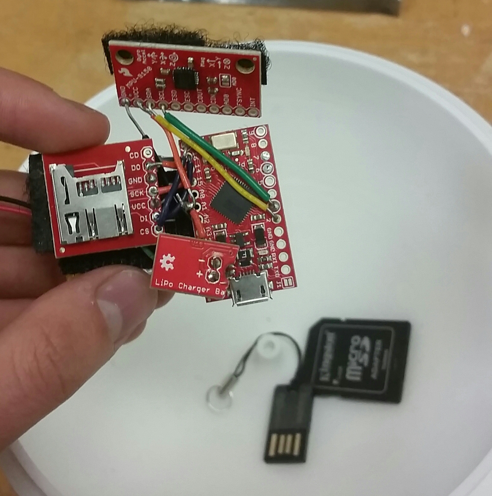

---
title: Case Studies in Robotics Toolchains
theme: Pittsburgh
color: beaver
header-includes:
	- \usepackage{svg}
	- \usepackage{jeffe}
date: September 9, 2016
author: |
    | Alli Nilles
    | \hfill
    | {width=75%}
...


Roadmap
-------

1.  Case Studies

    i)  Low level: Arduino / embedded programming
    i)  High level: ROS

2.  Lessons?

    i)  power vs. simplicity vs. flexibility (vs. verifiability?)
    i)  Ideas from functional programming
    i)  Good tools need good communities
    i)  Good communities form around good tools...

How to Evaluate Tools?
----------------------

\


Embedded Programming
====================

Case Study: Arduino Hacking
-----------------------------

\columnsbegin
\column{.5\textwidth}

-	Measure rotation of rolling ball robot, reconstruct motion
-	Need small footprint, onboard data logging
-	Easy to get rough estimate, hard to get exact

\column{.5\textwidth}

\

\columnsend

Takeaways
---------

-   Simplicity: where we tell beginners to start matters
    -   Is traditional C++ style programming the best place to start?
-   Powerful: large community
-   Lose flexibility when tied to Arduino platforms/libraries/IDE

Alternatives:

-   mBed: about as simple and powerful, more flexible through online IDE
-   possible fork into high-level and low-level languages
    -   microPython
    -   llvm for devices?

Takeaways
---------

-   Networking:
    -   Example: Need to network a home-grown OS on embedded device
    -   $\heartsuit$ rosserial $\heartsuit$: all you need is `init`, `read`,
        `write`, and `time`
    -   $\heartsuit$ ESP8266 $\heartsuit$
    -   Better to use networked chip than add a new component to your design

ROS
===

Case Study: ROS
---------------

\columnsbegin
\column{.5\textwidth}

My use cases:

-   Data logging
-   Playing with Spheros
-   Bluetooth and ROS

\column{.5\textwidth}

\

\columnsend

Takeaways
---------

-   flexible: large community, integrated with many platforms
-   powerful: scalable framework, solid protocols
-   simple?
    -   networking issues
        -   Ex: Optitrack Mocap
    -   versioning issues
        -   Ex: gazebo7 for Kinetic, gazebo2 for Indigo
    -   catkin
    -   XML

The Angle Bracket Tax [^1]
---------------

[^1]:
  [https://blog.codinghorror.com/xml-the-angle-bracket-tax/](https://blog.codinghorror.com/xml-the-angle-bracket-tax/)

```xml
<launch>
    <arg name="world" default="simple_world"/>
    <arg name="init_pos_x" default="0.0"/>
    <arg name="init_pos_y" default="0.0"/>
	<node pkg="gazebo_ros" type="spawn_model"
		name="spawn_robot"
		respawn="false" output="screen"
		args="-param robot_description
        -urdf
        -x $(arg init_pos_x)
        -y $(arg init_pos_y)
        -z $(arg init_pos_z)
        -model youbot">
    </node>
</launch>
```

Alternative: yaml
-----------------

```yaml

- world: simple_world
- init_pos_x: &init_pos_x 0.0
- init_pos_y: &init_pos_x 0.0
- node:
	- pkg: gazebo_ros
	- type: spawn_model
	- name: spawn_robot
	- respawn: false
	- output: screen
	- args:
		- param robot_description
        - urdf
        - x *arg init_pos_x
        - y *init_pos_y
        - z *arg init_pos_z
        - model youbot

```

More Takeaways
--------------

-   Lack of simplicity leads to wasted time
-   Low level timing issues left to user
    -   callbacks, "spinOnce"
    -   hard to enforce logic on Topics: what if I want to do something only
        when I have a pair of new values from two topics that publish at
        different rates?

Possible Solution: Haskell Client
---------------------------------

Credit to Anthony Cowley [^2], UPenn GRASP lab

[^2]:
  [https://github.com/acowley/roshask](https://github.com/acowley/roshask)

```haskell
sayHello =
	Topic $ do threadDelay 1000000
		t <- getCurrentTime
		let msg = S.String ("Hello world " ++ show t)
		return (msg, sayHello)
```
Problems:

-   time delay is brittle and hardcoded
-   delay is orthogonal to task of operating on value
-   verbose

roshask
-------

```haskell
sayHello :: Topic IO S.String
sayHello = repeatM (fmap mkMsg getCurrentTime)
	where mkMsg = S.String . ("Hello world " ++) . show

main = 	runNode "talker"
		$ advertise "chatter" (topicRate 1 sayHello)

```

Advantages:

-   Can optimize topicRate and reuse
-   Operation on data is independent of rate plumbing

Other nice things about roshask:

-   `everyNew`, `bothNew` functions
-   composable nodes: data on one machine is shared, not streamed, while
    preserving modularity

But why invest in learning Haskell?
-----------------------------------

-   High-level robotic control is functional in style
-   Built around infinite lists: natural for robotics
-   Type safety (already in ROS message types)
-   Lack of side-effects means robots that act more consistently and are easier
    to verify
-   Large community, Foreign Function Interface (FFI) is hardware-friendly
    -   [Learn you a Haskell for Great Good!](http://learnyouahaskell.com/)

Conclusions
===========

How to Move Towards the Middle?
-------------------------------

\
