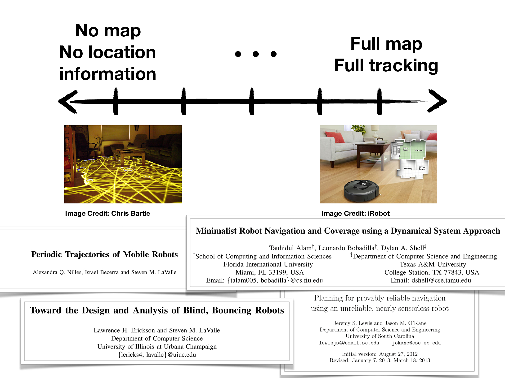
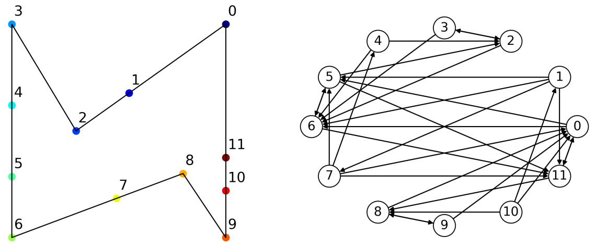
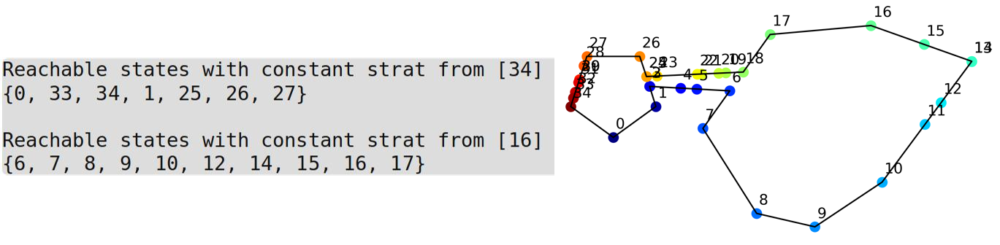
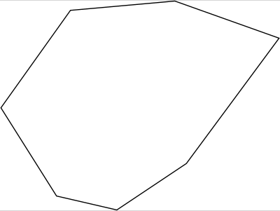

% A Visibility-Based Approach to Computing Nondeterministic Bouncing Strategies
% Alli Nilles, Samara Ren, Israel Becerra, Steven M. LaValle
% December 9, 2018

Minimalist Mobile Robots
============

{width=750px class="center"}\

A Different Motion Model
=============

Consider a point robot moving in a polygonal environment.

Tell the robot, "go forward until you can't any more!"

. . .

Compliance can reduce sensing and estimation requirements!

. . .

{width=700px}

**Bounce rule:** determines action $u \in (0, \pi)$ at boundary.

**Goal:** Plan over strategies of sequential **bounce rules**.

Interesting Baseline Behaviors
=====

Iterating the same rule can cause cycles and trapping regions:

{width=300px class="center"}

Combinatorial changes from small perturbations:

{width=300px class="center"}

#### First example inspired by Spagnolie, S. E., Wahl, C., Lukasik, J., & Thiffeault, J. L. (2017). Microorganism billiards. Physica D: Nonlinear Phenomena, 341, 33-44. ####

What About Uncertainty?
=======================

{width=400px class="center"}

Uncertainty is unavoidable... Plan over **nondeterministic** bounce rules!

. . .

Actions are convex open sets $\tilde{\theta} \subseteq (0,\pi)$

**Safe actions**: *Any* action in $\tilde{\theta}$ from *anywhere* on 
edge $e_i$ will get you to *somewhere* on edge $e_j$.

. . .

**Goal:** along with plan, output a characterization of how much uncertainty the
plan can tolerate (design constraints!)

Geometry Influences Dynamics
=====

Given geometry, we can explicitly analyze state transitions between intervals on
the boundary $\partial P$ under nondeterministic actions $\tilde{\theta}$:

$f: \partial P \times U \to \partial P$

**Observation:** $f$ is easier to analyze when looking at pairs of mutually
visible edges.

**Observation:** in a single action, the robot can only transition to visible
segments of the boundary.

### Use geometric structure to discretize space of possible trajectories! ###

Our Approach
============

> 1. Partition boundary using "visibility events"
> 2. Create *safe* edge-to-edge transition graph
> 3. Search for paths and cycles (depending on specification)
> 4. Translate paths to strategies

Visibility Decomposition
====

{width=600px class="center"}\

. . .

Static obstacles are ok too - same partitioning operation!

Safe Bounce Visibility Graph
============================

{width=750 class="center"}

Algorithm 1 of paper: polygon with $n$ vertices will produce bounce visibility
graph with $O(n^2)$ nodes and $O(n^4)$ edges.

Properties of Safe Bounce Visibility Graph
=============================

> - Some segments are unreachable under safe actions
> - **Proposition:**  For every polygon $P$ and the resulting partitioned polygon $P'$ under Algorithm
1, each edge $e \in P'$ has at least two safe actions which allow
transitions away from $e$.

{width=500 class="center"}

Example Path Queries
===============

Of all paths from A to B (up to bounded length), which allows the most unreliable robot?

. . .

From a given start set, what parts of the polygon boundary are reachable under
uncertainty? How much uncertainty?

. . .

What parts of polygon are reachable under a given set of actions?

. . .

What parts of the polygon are reachable with a constant controller?

. . .

{width=700px class="center"}\

Safe Stable Cycles
=================

A cycle is **stable** when the composition of transition functions is a
*contraction mapping*: two points under the mapping become closer together.

. . .

**Theorem:** For all convex polygons with $n$ edges, there exist constant fixed-angle bouncing
strategies which result in a period $n$ limit cycle regardless of the robot's start position.

. . .

**Proposition:** For all points $s$ on the boundary of all polygons, a constant
fixed-angle controller exists which will cause the robot's trajectory to enter a
stable limit cycle.

{width=250 style="float:left;padding:12px" class="center"}\ {width=350 style="float:right;padding:12px" class="center"}\

Example Cycle Queries
=============

> - Is there a safe cycle which visits edge set $E$ (in a particular order, or not)?
>   - Note that safe cycles are "stable," even if they do not have the
>     contraction property for all $s, \theta$.

> - For actions with uncertainty $\pm \epsilon$, is there a reachable cycle which will
    shrink the size of the robot's state estimate below $\delta$?
    

Dirty Laundry
=============

> - Not complete: given a small start set, safe paths exist that we cannot find
> - We can't actually ignore corners always
> - Needs experimental validation!

. . .

<iframe width="300" height="275"
src="images/robot_vid2.m4v"
frameborder="0" allowfullscreen>
</iframe>

<iframe width="300" height="250"
src="images/rotate.mp4"
frameborder="0" allowfullscreen>
</iframe>

Future Work
===========

> - How to plan over limit cycles? There are exponentially many, but only some
    are "good" (admit relatively large error cones, chain together 
    easily with other limit cycles, etc)
> - Code refactor, leading to design of high-level specification language
>    - LTL-ish (eventually reach region *A*... stay in region *B* until...)
>    - Multirobot context: guarantees on robot presence and density

> - More concrete applications
>   - Mobile robot monitoring conditions in warehouse, greenhouse, office
>   - Forest fire detecting drones, and other conservation applications

Thank you! Questions?
==========

{width=200 class="center"}\

#### Presentation Template from https://github.com/PeterMosmans/presentation-template ####

